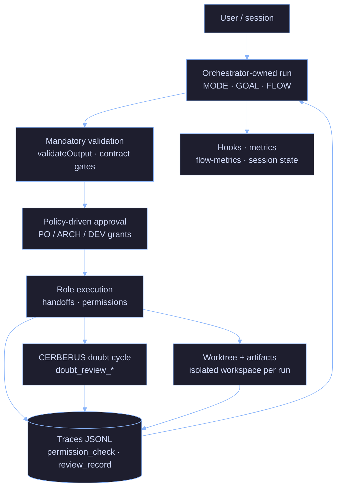

# AI Minions

[](./LICENSE) [](https://github.com/aetorresdev/ai-minions/releases) [](https://github.com/aetorresdev/ai-minions/issues) [](https://github.com/aetorresdev/ai-minions/pulls) [](https://github.com/aetorresdev/ai-minions/commits/master) [](https://github.com/aetorresdev/ai-minions/actions/workflows/orchestrator-unit-tests.yml) [](https://github.com/aetorresdev/ai-minions/actions/workflows/orchestrator-e2e.yml)

## Start here

Trying to **install, run, and validate** without reading this whole page? Jump directly:

| Goal | Where |
|------|--------|
| **Primary product CLI** (`init` / `doctor` / `start` / `status` / `explain` / `evidence` / `context`) | [Quickstart — Stage 2](#stage-2-product-cli-ai-minions) · [`ai-minions-command-migration.md`](docs/how-to/ai-minions-command-migration.md) |
| Full staged path | [Quickstart](#quickstart) |
| Complete smoke walkthrough | [`docs/how-to/usage-smoke-guide.md`](docs/how-to/usage-smoke-guide.md) · [Happy path](docs/how-to/usage-smoke-guide.md#happy-path-end-to-end-runbook) |
| Clone + install + unit tests | [Stage 1: Install and validate locally](#stage-1-install-and-validate-locally) |
| Alpha boundaries and caveats | [Known limitations (alpha)](#known-limitations-alpha) · [Beta limitations (v0.15)](docs/how-to/beta-known-limitations.md) |
| Something failed during smoke | [Troubleshooting](docs/how-to/usage-smoke-guide.md#troubleshooting) |
| **Advanced — Claude Code skill** (no MODE header) | [Stage 3: Run a simple skill](#stage-3-run-a-simple-skill) |
| **Advanced — MODE orchestration** | [Stage 4: Run orchestration in Claude Code](#stage-4-run-orchestration-in-claude-code) |
| **Advanced — legacy scripts** (`runner:tui`, `run-orchestrator`, primary smoke) | [Stage 5: Legacy and deeper control](#stage-5-legacy-and-deeper-control) |
| Bootstrap + preflight (reason codes) | [Bootstrap and preflight](docs/how-to/bootstrap-preflight.md) |
| Primary CLI smoke + trace path (legacy script) | [Primary smoke](docs/how-to/primary-smoke.md) · `node scripts/run-primary-smoke.mjs` |
| Fresh-clone evidence + claim audit | [Fresh-clone evidence](docs/how-to/fresh-clone-evidence.md) · `node scripts/run-fresh-clone-evidence.mjs` |
| Secrets, `.env`, and `ENVIRONMENT` | [Values vs permission](#values-vs-permission-env-and-secrets) |
| Optional MCP / tool integrations | [Stage 6: MCP setup](#stage-6-mcp-setup-optional) |
| **Runner TUI guided run** (legacy) | [`docs/how-to/operator-guided-run.md`](docs/how-to/operator-guided-run.md) |
| Operator preflight bridge (`PREFLIGHT_*` + `OPERATOR_*`) | [`docs/how-to/operator-preflight-bridge.md`](docs/how-to/operator-preflight-bridge.md) |
| Inspect run evidence (`INSPECT_*`) | [`docs/how-to/inspect-run-evidence.md`](docs/how-to/inspect-run-evidence.md) · `node scripts/inspect-run-evidence.mjs <task_id>` |
| Collect run report bundle (`BUNDLE_*`) | [`docs/how-to/collect-run-report.md`](docs/how-to/collect-run-report.md) · `node scripts/collect-run-report.mjs <task_id>` |
| File operator feedback (GitHub issue form) | [`docs/how-to/operator-feedback-issue.md`](docs/how-to/operator-feedback-issue.md) |
| Internal beta dry-run (end-to-end runbook) | [`docs/how-to/beta-tester-guide.md`](docs/how-to/beta-tester-guide.md) |
| Beta dry-run checklist + sample issue | [`docs/how-to/beta-dry-run-checklist.md`](docs/how-to/beta-dry-run-checklist.md) |
| Beta smoke matrix (external beta gate) | [`docs/how-to/beta-smoke-matrix.md`](docs/how-to/beta-smoke-matrix.md) |
| Beta degraded-mode policy | [`docs/how-to/beta-degraded-mode-policy.md`](docs/how-to/beta-degraded-mode-policy.md) |
| Beta limitations onboarding contract | [`docs/orchestrator/beta-limitations-onboarding-contract.md`](docs/orchestrator/beta-limitations-onboarding-contract.md) |
| Validate gate-hardening docs (verify + claims) | [`docs/how-to/beta-gate-hardening-evidence.md`](docs/how-to/beta-gate-hardening-evidence.md) · `node scripts/run-beta-gate-hardening-evidence.mjs` |
| Validate modular closeout evidence (v0.17) | [`docs/how-to/modular-closeout-evidence.md`](docs/how-to/modular-closeout-evidence.md) · `node scripts/run-modular-closeout-evidence.mjs` |
| Doc alignment verify | `node scripts/verify-usage-docs.mjs` |
| Product claim audit | `node scripts/audit-product-claims.mjs` |
| End-to-end runbook (step-by-step) | [Happy path](docs/how-to/usage-smoke-guide.md#happy-path-end-to-end-runbook) |
| Something failed during smoke | [Troubleshooting](docs/how-to/usage-smoke-guide.md#troubleshooting) |

---

Most AI coding tools can write code. They do not enforce roles, gates, approvals, or traceable workflow boundaries.

**ai-minions** is a **control-first AI workflow harness** for engineers who want AI-assisted work to be **reviewable before it becomes risky**.

**Your CI/CD governs what ships.** ai-minions governs **how AI helps build it** (contracts, traces, permission gates, CERBERUS review, budget stops—not another editor competing with your pipeline tools).

Technical framing: **contract-driven agent harness** — see [`docs/orchestrator/harness-engineering-positioning.md`](docs/orchestrator/harness-engineering-positioning.md). Do not describe the project primarily as a “multi-agent framework” or “autonomous agent platform.”

**Execution modes** (control-first, not swarm-first):

1. **Single-agent / multi-role** — one session, multiple contractual roles sequentially; default for local runs, cost, and debugging.
2. **Supervised multi-agent** — bounded agents under an orchestrator-owned run; the orchestrator keeps budget, permissions, trace, approvals, and outcome.

Supports **single-agent multi-role** workflows and **supervised multi-agent** execution. Multi-agent is an **execution strategy**, not the product category. **ai-minions is control-first, not single-agent-only.** Not a swarm platform, LangGraph alternative, or “advanced multi-agent framework” claim.

**Validation is mandatory. Human approval is configurable.** Risk determines whether human approval is required—a well-defined epic may skip manual PO approval when policy allows, but never skip contractual validation. See [`harness-engineering-positioning.md`](docs/orchestrator/harness-engineering-positioning.md) § Validation vs human approval.

It focuses on:

- Explicit role contracts
- Compact handoffs
- Validation gates
- Traceable decisions
- Permission-aware execution
- Observable run outcomes

The goal is not to make agents sound autonomous. The goal is to make agent behavior **bounded, auditable, and rejectable** before it damages the workflow.

> ai-minions is not trying to make agents more human. It is building the harness around them so their work becomes bounded, observable, testable, and rejectable.
> *Si no lo entiendo, no lo apruebo.* — If I don't understand it, I don't approve it.
> Most production incidents start with someone doing exactly the opposite.

---

## What is ai-minions?

- A **human-supervised**, **contract-driven** harness for AI-assisted software work: fixed MODE roles, structured handoffs, and validation gates—not an autonomous team that owns releases.
- **Control-first, not single-agent-only:** multi-agent is an execution mode under governance, not the product category ([`harness-engineering-positioning.md`](docs/orchestrator/harness-engineering-positioning.md) § Execution modes).
- **Manager-owned orchestration:** the orchestrator plans and gates work; **handoffs** are for explicit ownership transfer, not every role switch. See [`docs/orchestrator/agent-contract.md`](docs/orchestrator/agent-contract.md) (MODE + YAML).
- **Evidence over chat memory:** traces, `validateOutput`, and optional MCP-backed gates—not “vibes” as the audit trail. Orchestrator product path: [`orchestrator/README.md`](orchestrator/README.md).

---

## Problems it solves

The default agent stack is structurally unsafe for anything that actually matters in production—and that is exactly where people are starting to use it:

| Failure mode | Why it burns you |
|---|---|
| **Prompt engineering at scale** | Instructions drift; nobody can replay *why* a decision counted. |
| **Naive multi-agent** | Cost explodes; you still have no gate on "did this transition actually happen?" |
| **Unvalidated outputs** | Confident prose with no artifact list, no test output, no blocked advance. |
| **No role separation** | One chat mixes author, reviewer, and release narrative. Accountability collapses. |

---

## Without ai-minions vs with ai-minions

| Without | With |
|---------|------|
| Roles and accountability blur in one thread | One MODE per response; contracts in [`agent-contract.md`](docs/orchestrator/agent-contract.md) |
| Tool/network access easy to mis-scope | Permission classification + gates + `permission_check` traces ([`runtime-permission-contract.md`](docs/orchestrator/runtime-permission-contract.md)) |
| Cost and failures as folklore | Token summaries, budget hard-stop, JSONL traces ([`strict-mode.md`](docs/orchestrator/strict-mode.md), [`orchestrator/README.md`](orchestrator/README.md)) |

---

## Philosophy

AI systems should be treated as engineering systems, not collaborators.

- Outputs are not trusted — they are validated
- Roles are not blended — they are isolated
- Progress is not assumed — it is gated
- Cost is not ignored — it is measured

---

## How it works

Three control layers:

**1. Roles and contracts** — Fixed MODEs (`ORCHESTRATOR`, `OWNER`, `ARCHITECT`, `DEV`, `QA`, `CERBERUS`) with explicit FORBID rules and structured YAML handoffs. One role per response; no self-review. Full contract: [`docs/orchestrator/agent-contract.md`](docs/orchestrator/agent-contract.md).

**2. Validation** — Every agent step is checked by `validateOutput()` against a role contract. Failures are explicit (`gate_id`). No silent pass. When MCPs are enabled, `orchestrator-state` enforces transitions on disk—the transcript does not override the log.

**3. Observability** — Hooks write token/cost/MODE summaries per session and per phase. Traces record contract failures, gate results, and blocker counts. Same `GOAL`, different `FLOW` → diff the files.

Full wiring: [`docs/orchestrator/system-architecture-diagram.md`](docs/orchestrator/system-architecture-diagram.md).

---

## What makes this different

- Contracts are **enforced**, not suggested
- Transitions are **gated**, not assumed
- Failures are **recorded**, not hidden
- Comparisons are based on **traces**, not impressions
- Degraded mode is **loud**, not silent

---

## Quickstart

**Goal:** clone → install → `ai-minions init` → `doctor` → `start` → `status`/`explain` → `evidence`/`context` → (optional) Claude Code skill, MODE header, or legacy scripts.

Full walkthrough and troubleshooting: [`docs/how-to/usage-smoke-guide.md`](docs/how-to/usage-smoke-guide.md).

### Before you start

| Check | Command / note |
|-------|----------------|
| Node.js ≥ 18 | `node --version` |
| Claude Code + `claude` CLI | `claude --version` · `claude auth status` (required for live orchestration) |
| Editor (typical) | Cursor or Warp — paste MODE headers in chat |
| Ollama (optional) | Planner/summarizer — [`local-model-discovery.md`](docs/orchestrator/local-model-discovery.md) |

### What runs (runtime map)

| Piece | Role | Needed for `npm test`? |
|-------|------|------------------------|
| **Node runner** (`orchestrator/`) | Planning loop, gates, traces | **Yes** — `npm ci` + `npm test` |
| **`claude` CLI** | Worker agents (DEV/QA/CERBERUS) | No (yes for live orchestration) |
| **Ollama** | Local planner / handoff summarizer | No |
| **Skills** (`skills/`) | Prompt/workflow instructions in chat; no side effects by themselves | No |
| **MCP servers** | Optional tools + on-disk gates; missing → **degraded mode** (banner) | No |

`npm test` validates the **Node harness only** — not full live orchestration with worker agents.

**Not claimed in this release:** packaged global installer · production TUI (`runner:tui` = CLI MVP) · provider-agnostic worker backend.

Contract detail: [`orchestrator/README.md`](orchestrator/README.md).

---

### Stage 1: Install and validate locally

Clone anywhere; the commands below use the default folder name `ai-minions`. Do not assume `~/.claude` unless you want the maintainer layout.

```bash
git clone https://github.com/aetorresdev/ai-minions.git
cd ai-minions
node scripts/bootstrap-preflight.mjs --install
cd orchestrator
npm test
```

Preflight uses stable `reason_code` values (layout, Node, deps, trace dir) — [`bootstrap-preflight.md`](docs/how-to/bootstrap-preflight.md). Add `--live` before worker-agent runs.

Passing unit tests means the harness is wired; it does **not** prove Claude CLI orchestration end-to-end.

<details>
<summary>Optional: maintainer layout (<code>~/.claude</code>)</summary>

```bash
git clone https://github.com/aetorresdev/ai-minions.git ~/.claude
```

Some hooks/skills docs assume this path.
</details>

---

### Stage 2: Product CLI (`ai-minions`)

Primary operator path — wrappers over existing install, preflight, launch, and trace-readback contracts. **Not** a polished product UI; **not** a global installer.

```bash
cd ai-minions/orchestrator
npm run ai-minions -- --help
npm run ai-minions -- init --model-policy local_only
npm run ai-minions -- doctor --model-policy local_only
npm run ai-minions -- start --goal "Smoke: list three files under orchestrator/ and stop" \
  --skip-gates --iterations 1
# record task_id from output
npm run ai-minions -- status --run-id <task_id>
npm run ai-minions -- explain --run-id <task_id>
npm run ai-minions -- evidence --run-id <task_id>
npm run ai-minions -- context --run-id <task_id>
npm run ai-minions -- resume --run-id <task_id>   # honest probe: RUN_RESUME_NOT_IMPLEMENTED (exit 2)
```

| Step | Command | Exit signal |
|------|---------|-------------|
| Init / config | `npm run ai-minions -- init --model-policy local_only` | `0` + config paths |
| Doctor | `npm run ai-minions -- doctor --model-policy local_only` | `0` + no blocking `PREFLIGHT_*` |
| Launch | `npm run ai-minions -- start --goal "..." --skip-gates --iterations 1` | `0` + `done: true` · record `task_id` |
| Result | `npm run ai-minions -- status --run-id <task_id>` | `0` + terminal summary |
| Explain | `npm run ai-minions -- explain --run-id <task_id>` | `0` + critical decision summary |
| Evidence | `npm run ai-minions -- evidence --run-id <task_id>` | `0` + inspect/bundle paths |
| Context | `npm run ai-minions -- context --run-id <task_id>` | `0` + disclosure panel |
| Resume probe | `npm run ai-minions -- resume --run-id <task_id>` | `2` + `RUN_RESUME_NOT_IMPLEMENTED` — **not** durable resume |

`--skip-gates` is **degraded mode** (banner visible) — fine for first contact. Full mapping: [`ai-minions-command-migration.md`](docs/how-to/ai-minions-command-migration.md).

Live `start` requires `claude` CLI (`claude auth status`). `npm test` alone does not prove end-to-end orchestration.

---

### Stage 3: Run a simple skill

*Advanced — Claude Code.*

In Claude Code, send a skill prompt **without** a MODE header:

```text
Review this Dockerfile
```

Confirms the editor loads repo skills. Does **not** exercise orchestrator gates, traces, or multi-role contracts.

---

### Stage 4: Run orchestration in Claude Code

*Advanced.*

**4a — Minimal run** (files/specs only, no live APIs):

```text
MODE: ORCHESTRATOR
FLOW: single_agent
GOAL: <your goal here>
MAX_ITERATIONS: 3
```

**4b — Background / other repo** — add `FLOW: multi_agent` and absolute `CWD`:

```text
MODE: ORCHESTRATOR
FLOW: multi_agent
GOAL: <your goal here>
MAX_ITERATIONS: 3
CWD: /absolute/path/to/target/project
```

**4c — Live APIs** — append `ENVIRONMENT` with **env var names only** (never secret values):

```text
ENVIRONMENT:
  mode: read
  credentials:
    - name: example_api
      type: api_key
      vars:
        url: EXAMPLE_API_URL
        key: EXAMPLE_API_TOKEN
```

Full schema: [`environment-access.md`](docs/orchestrator/environment-access.md).

#### Values vs permission (`.env` and secrets)

Two layers — do not mix them:

| Layer | You put here | Grants permission? |
|-------|----------------|----------------------|
| **`.env` / shell / CI `env`** | Secret **values** in `process.env` (`export`, `source` a gitignored file, GitHub `secrets` → `env`) | **No** — only makes values available to the process |
| **`ENVIRONMENT` in the header** | **Names** of env vars + access `mode` (`read` / `write`) | **Yes** — declares what this run may use |

**Rules:**

1. Never paste tokens, passwords, or connection strings into chat, README, or the `ENVIRONMENT` block.
2. No `ENVIRONMENT` block → intent is **no credential access** for that run.
3. Prior runs, traces, or snapshots do **not** carry permission into a new run.
4. In CI: map `secrets` → job `env` → reference the same **names** in `ENVIRONMENT`.

**Local values file (illustrative):**

`.env.local` is storage only — load into the shell before running the orchestrator:

```bash
cd ai-minions
cat > .env.local <<'EOF'
EXAMPLE_API_URL=https://api.example.com
EXAMPLE_API_TOKEN=<your-token>
EOF

set -a
source .env.local
set +a
```

The header references `EXAMPLE_API_URL` and `EXAMPLE_API_TOKEN` under `vars` — not the values.

---

### Stage 5: Legacy and deeper control

*Advanced / troubleshooting.*

Use when debugging wrappers, comparing trace paths, or following older runbooks. **Not** the primary onboarding path.

```bash
cd ai-minions/orchestrator
node run-orchestrator.js --help
npm run runner:tui -- --help
```

| Path | When |
|------|------|
| `npm run runner:tui -- preflight` | Legacy preflight panels (prefer `ai-minions doctor`) |
| `node run-orchestrator.js …` | Direct runner invocation |
| `node scripts/run-primary-smoke.mjs --run` | Legacy smoke wrapper (prefer `ai-minions start`) |

Guided `runner:tui` walkthrough: [`operator-guided-run.md`](docs/how-to/operator-guided-run.md). Slash aliases (doc only): [`operator-slash-commands.md`](docs/how-to/operator-slash-commands.md).

**Legacy CLI smoke** — repeatable degraded run + trace path (no Claude chat):

```bash
cd ai-minions
node scripts/run-primary-smoke.mjs          # smoke note: command + trace path
node scripts/run-primary-smoke.mjs --run    # live run (requires claude CLI)
node scripts/run-primary-smoke.mjs --inspect <task_id>
```

Full contract: [`primary-smoke.md`](docs/how-to/primary-smoke.md).

---

### Stage 6: MCP setup (optional)

MCPs add tools and stronger on-disk gate enforcement. Without them: **degraded mode** — explore OK, weaker transition enforcement.

- Install: [`docs/mcp-installation.md`](docs/mcp-installation.md)
- Gates / banner: [`strict-mode.md`](docs/orchestrator/strict-mode.md)

---

### Stage 7: Full smoke guide

After Stages 1–2 (and optional advanced stages): follow the [happy path runbook](docs/how-to/usage-smoke-guide.md#happy-path-end-to-end-runbook) and [troubleshooting](docs/how-to/usage-smoke-guide.md#troubleshooting) if blocked.

Canonical reference: [`usage-smoke-guide.md`](docs/how-to/usage-smoke-guide.md). Primary CLI smoke: [`primary-smoke.md`](docs/how-to/primary-smoke.md). Fresh-clone evidence: [`fresh-clone-evidence.md`](docs/how-to/fresh-clone-evidence.md). Token/session habits: [`token-hygiene-guide.md`](docs/orchestrator/token-hygiene-guide.md).

---

### Known limitations (alpha)

| Topic | Reality |
|-------|---------|
| Production readiness | Alpha — no SLA; see [Maturity](#maturity-implemented--planned--not-claimed) |
| `npm test` | Harness only — not full agent smoke |
| `FLOW: multi_agent` | Incomplete for some comparisons; metrics directional |
| Degraded mode | Missing MCPs or `--skip-gates` = less protection; banner must show |
| Bootstrap | No global installer — `scripts/bootstrap-preflight.mjs` + manual clone |
| Gate-hardening doc validation | `node scripts/run-beta-gate-hardening-evidence.mjs` — not external beta approval |

More: [`orchestrator/README.md`](orchestrator/README.md) § Known limitations · beta dry-run consolidation: [`beta-known-limitations.md`](docs/how-to/beta-known-limitations.md) · verify wiring: [`beta-gate-hardening-evidence.md`](docs/how-to/beta-gate-hardening-evidence.md).

---

## Experiments and metrics

Three evidence classes. Same `GOAL`, different `FLOW` → diff the files, not the chat.

| Signal class | What it measures | Where it lives |
|---|---|---|
| **Cost** | Tokens and USD per session, per phase, per MODE | `flow-metrics.jsonl` (hook on `Stop`) |
| **Control failures** | `contract_fail`, `gate_result: false`, `degraded_mode` | `traces/<task_id>.jsonl` |
| **Runtime defects** | QA/CERBERUS findings, blocker counts, `validation_run` output | Handoffs + `cerberus_check` trace events |

**Interpretation rule:** if you cannot explain the delta between two runs using these three signals, the comparison is invalid.

### Status — SA vs MA

| `FLOW` | State |
|---|---|
| `single_agent` | Primary usage — multiple runs. |
| `multi_agent` | Supported as a **supervised** execution strategy, but still **alpha/incomplete** for broad comparisons. SA vs MA metrics remain **directional only**. |

---

## Core principles (Anthropic AI Fluency 4D)

The four competency names come from Anthropic's **AI Fluency** framework (© 2025 Rick Dakan, Joseph Feller, and Anthropic — CC BY-NC-SA 4.0). Canonical definitions: [anthropic.com/ai-fluency](https://anthropic.skilljar.com/ai-fluency-framework-foundations). The table below is only how they map to **this repo**:

| Principle | In this repo |
|---|---|
| **Delegation** | MODE routing — one role per response, no hat-swapping. |
| **Description** | YAML handoffs + per-role output minimums. |
| **Discernment** | QA and CERBERUS lanes; `validateOutput` hard fails. |
| **Diligence** | Append-only event log; degraded mode is explicit, never silent. |

---

## What this is NOT

- Not autonomous AI engineering — humans own scope, risk, and approval.
- Not a replacement for engineers — a structure for how agents are run and reviewed.
- Not prompt-engineering magic — wrong contracts fail in the open, not silently.
- Not a benchmark — SA vs MA metrics are directional only; no fabricated leaderboard tables here.
- Not a general **self-hosted AI workspace** or chat-first productivity app — control harness for reviewable agent work only.

---

## Security posture (honest)

**Full narrative (threats, gaps, layers):**
[`security-posture.md`](docs/orchestrator/security-posture.md).

**Treat ai-minions as an admin console** — tools, shell, MCP, local models, and
filesystem access are **privileged**. Do **not** expose the stack to the public
internet without your own auth, network controls, and secret handling.

- **Production Boundary Guard:** default mode **`agent_as_contributor`** — agents prepare
  branches/PRs/evidence; merge/tag/release stay human-controlled unless explicitly
  exceptional policy. Model and trace contract:
  [`production-boundary-guard.md`](docs/orchestrator/production-boundary-guard.md).
- **Shipped controls (see code + contracts):** capability matrix pre-check, MCP /
  shell / network / classified-invocation gates, trace schema, secret-shaped
  redaction — [`runtime-permission-contract.md`](docs/orchestrator/runtime-permission-contract.md),
  [`trace-privacy-contract.md`](docs/orchestrator/trace-privacy-contract.md),
  [`strict-mode.md`](docs/orchestrator/strict-mode.md).
- **Not a sandbox product:** widening `.ai-minions/permissions.yaml`, skipping gates,
  or ignoring degraded-mode banners can still cause real damage. The harness
  **reduces** risk; it does not **eliminate** operator responsibility.
- **Not secure-by-default** for casual public deployment — see admin-console section
  in the security doc.
- **Contracts stay authoritative** for exact behavior; the link above is the
  readable map.

---

## Maturity: implemented / planned / not claimed

| Bucket | What it means here |
|--------|---------------------|
| **Implemented** | MODE protocol + YAML handoffs, `validateOutput`, JSONL traces, permission evaluator + runtime gates, token/cost reporting and run budget hard-stop, hook metrics, worktree isolation (v0.3), CERBERUS doubt cycle + `review_record`, **v0.18 product CLI** (`npm run ai-minions` — init/start/status/explain/doctor/evidence/context/resume as wrappers), operator trace summary for status/explain, design contracts for BV gate and progressive disclosure (validators/tests). |
| **Partial** | Skill registry allowlist (`skill-registry.v1.json`); untrusted-context fixture harness; handoff/sandbox **design** docs |
| **Planned** | Durable session/resume semantics (beyond honest `RUN_RESUME_NOT_IMPLEMENTED` probe); skill router runtime; sandbox/credential broker runtime; progressive-disclosure **enforcement** in runner — see [`docs/orchestrator/README.md`](docs/orchestrator/README.md), not implied as shipped. |
| **Not claimed** | Production SLA, OSI “open source” license, hosted control plane, turnkey marketplace, multi-tenant isolation, general AI workspace, fully sandboxed autonomous execution — see [`LICENSE`](LICENSE) and [`COMMERCIAL_LICENSE.md`](COMMERCIAL_LICENSE.md). |

---

## Roadmap (high level)

1. Keep **contracts, gates, and traces** aligned with code under `orchestrator/` and `docs/orchestrator/`.
2. **Alpha readiness:** run and release checklists — [`pre-run-checklist.md`](docs/orchestrator/pre-run-checklist.md), [`alpha-release-checklist.md`](docs/orchestrator/alpha-release-checklist.md).
3. **Harness positioning (detail):** [`docs/orchestrator/harness-engineering-positioning.md`](docs/orchestrator/harness-engineering-positioning.md) — README stays the map, not the full design. Layer stack: [`docs/orchestrator/agent-harness.md`](docs/orchestrator/agent-harness.md).

Full doc index: [`docs/orchestrator/README.md`](docs/orchestrator/README.md).

---

## Architecture



Full wiring diagram: [`docs/orchestrator/system-architecture-diagram.md`](docs/orchestrator/system-architecture-diagram.md).

---

## Repository map

| | |
|---|---|
| [`docs/orchestrator/security-posture.md`](docs/orchestrator/security-posture.md) | Public security posture + threat model (honest); links contracts and tests |
| [`docs/orchestrator/agent-contract.md`](docs/orchestrator/agent-contract.md) | Roles, handoff YAML, state-store authority, output contracts |
| [`docs/orchestrator/harness-engineering-positioning.md`](docs/orchestrator/harness-engineering-positioning.md) | Harness engineering framing; manager-owned orchestration; implemented vs not claimed |
| [`docs/orchestrator/local-inference-sizing.md`](docs/orchestrator/local-inference-sizing.md) | Local inference RAM/VRAM sizing (guidance only — not benchmarks) |
| [`docs/orchestrator/agent-harness.md`](docs/orchestrator/agent-harness.md) | Harness layers (context, memory/state, control, validation, observability) |
| [`docs/optional-contract-mode.md`](docs/optional-contract-mode.md) | Optional `minions.md` contract mode: goals, non-goals, behavior matrix (phase 1 design) |
| [`orchestrator/`](orchestrator/) | Node product runner: planning, `validateOutput`, MCP gates, traces |
| [`mcp-servers/orchestrator-state/`](mcp-servers/orchestrator-state/) | Disk-backed task store + gate MCP (pytest included) |
| [`mcp-servers/compact-handoff/`](mcp-servers/compact-handoff/) | Handoff compaction + alignment helpers (local Ollama) |
| [`scripts/hooks/`](scripts/hooks/) | Lifecycle hooks: MODE enforcement, context efficiency, handoff + QA skill enforcement, token/cost tracking, session state. Shared: `constants.py`, `gate_logger.py` |
| [`skills/`](skills/) | Task-scoped playbooks: Terraform, Docker, CI, n8n, observability, specs |
| [`agents/`](agents/) | Specialized subagent definitions consumed by skills |

Hook wiring: copy `settings.json.example` → `settings.json` and adapt paths. Do not commit secrets.

---

## License

AI Minions is **source-available** software.

You may use this repository for personal use, learning, research, evaluation, and community contribution under the terms of the [LICENSE](LICENSE). See also [NOTICE](NOTICE).

A **separate commercial license** is required for:

- internal business use
- production deployment for business purposes
- consulting or client delivery
- hosted / managed service use
- embedding AI Minions into a commercial product or service

Details: [COMMERCIAL_LICENSE.md](COMMERCIAL_LICENSE.md). Branding rules: [TRADEMARKS.md](TRADEMARKS.md).

This project is **not** licensed under an OSI-approved open source license.

For commercial licensing inquiries: **andres.torresduran@gmail.com**

[CONTRIBUTING.md](CONTRIBUTING.md)

---

*Legible before approval — not prettier prompts.*
