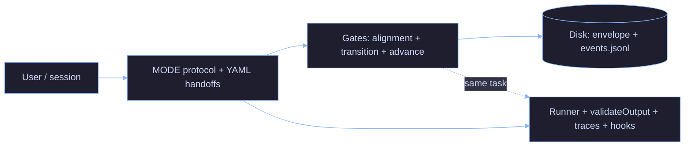

# AI Minions

[](./LICENSE) [](https://github.com/aetorresdev/ai-minions/releases) [](https://github.com/aetorresdev/ai-minions/issues) [](https://github.com/aetorresdev/ai-minions/pulls) [](https://github.com/aetorresdev/ai-minions/commits/main) [](https://github.com/aetorresdev/ai-minions/actions/workflows/orchestrator-unit-tests.yml) [](https://github.com/aetorresdev/ai-minions/actions/workflows/orchestrator-e2e.yml)

AI coding workflows fail because they optimize output, not process.

**ai-minions** is a **contract-driven agent harness** for orchestrating AI-assisted software workflows. Positioning matters: it is not defined primarily as “multi-agent orchestrator”—that label undersells the control plane.

It focuses on:

- Explicit role contracts
- Compact handoffs
- Validation gates
- Traceable decisions
- Permission-aware execution
- Observable run outcomes

The goal is not to make agents sound autonomous. The goal is to make agent behavior **bounded, auditable, and rejectable** before it damages the workflow.

The goal is not to make AI feel smarter. It is to make it **harder to approve something you do not understand**—because that is exactly how broken systems get shipped.

> ai-minions is not trying to make agents more human. It is building the harness around them so their work becomes bounded, observable, testable, and rejectable.
> *Si no lo entiendo, no lo apruebo.* — If I don't understand it, I don't approve it.
> Most production incidents start with someone doing exactly the opposite.

---

## What is ai-minions?

- A **human-supervised**, **contract-driven** harness for AI-assisted software work: fixed MODE roles, structured handoffs, and validation gates—not an autonomous team that owns releases.
- **Manager-owned orchestration:** the orchestrator plans and gates work; **handoffs** are for explicit ownership transfer, not every role switch. See [`docs/orchestrator/harness-engineering-positioning.md`](docs/orchestrator/harness-engineering-positioning.md) (full model) and [`docs/orchestrator/agent-contract.md`](docs/orchestrator/agent-contract.md) (MODE + YAML).
- **Evidence over chat memory:** traces, `validateOutput`, and optional MCP-backed gates—not “vibes” as the audit trail. Orchestrator product path: [`orchestrator/README.md`](orchestrator/README.md).

---

## Problems it solves

The default agent stack is structurally unsafe for anything that actually matters in production—and that is exactly where people are starting to use it:

| Failure mode | Why it burns you |
|---|---|
| **Prompt engineering at scale** | Instructions drift; nobody can replay *why* a decision counted. |
| **Naive multi-agent** | Cost explodes; you still have no gate on "did this transition actually happen?" |
| **Unvalidated outputs** | Confident prose with no artifact list, no test output, no blocked advance. |
| **No role separation** | One chat mixes author, reviewer, and release narrative. Accountability collapses. |

---

## Without ai-minions vs with ai-minions

| Without | With |
|---------|------|
| Roles and accountability blur in one thread | One MODE per response; contracts in [`agent-contract.md`](docs/orchestrator/agent-contract.md) |
| Tool/network access easy to mis-scope | Permission classification + gates + `permission_check` traces ([`runtime-permission-contract.md`](docs/orchestrator/runtime-permission-contract.md)) |
| Cost and failures as folklore | Token summaries, budget hard-stop, JSONL traces ([`strict-mode.md`](docs/orchestrator/strict-mode.md), [`orchestrator/README.md`](orchestrator/README.md)) |

---

## Philosophy

AI systems should be treated as engineering systems, not collaborators.

- Outputs are not trusted — they are validated
- Roles are not blended — they are isolated
- Progress is not assumed — it is gated
- Cost is not ignored — it is measured

---

## How it works

Three control layers:

**1. Roles and contracts** — Fixed MODEs (`ORCHESTRATOR`, `OWNER`, `ARCHITECT`, `DEV`, `QA`, `CERBERUS`) with explicit FORBID rules and structured YAML handoffs. One role per response; no self-review. Full contract: [`docs/orchestrator/agent-contract.md`](docs/orchestrator/agent-contract.md).

**2. Validation** — Every agent step is checked by `validateOutput()` against a role contract. Failures are explicit (`gate_id`). No silent pass. When MCPs are enabled, `orchestrator-state` enforces transitions on disk—the transcript does not override the log.

**3. Observability** — Hooks write token/cost/MODE summaries per session and per phase. Traces record contract failures, gate results, and blocker counts. Same `GOAL`, different `FLOW` → diff the files.

Full wiring: [`docs/orchestrator/system-architecture-diagram.md`](docs/orchestrator/system-architecture-diagram.md).

---

## What makes this different

- Contracts are **enforced**, not suggested
- Transitions are **gated**, not assumed
- Failures are **recorded**, not hidden
- Comparisons are based on **traces**, not impressions
- Degraded mode is **loud**, not silent

---

## Quickstart

**Prerequisites:** Cursor or Warp with Claude Code. Node.js ≥ 18 for the strict runner (optional). MCP servers and CLI tools per the skill you use—see [`docs/mcp-installation.md`](docs/mcp-installation.md).

**Install:**

```bash
git clone https://github.com/aetorresdev/ai-minions.git ~/.claude
```

**Orchestrator (Node) smoke** — from clone root:

```bash
cd ~/.claude/orchestrator && npm ci && npm test
# Optional strict path (Ollama + uv venvs + ORCH_PYTHON — see orchestrator/README.md § Tests):
# ORCH_PYTHON=../mcp-servers/orchestrator-state/.venv/bin/python npm run test:e2e:strict
```

**Test a skill** (no header needed):

```
Review this Dockerfile
```

**Run orchestrated work** (paste at the start of any chat):

```
MODE: ORCHESTRATOR
FLOW: single_agent
GOAL: <your goal here>
MAX_ITERATIONS: 3
```

Add `FLOW: multi_agent` + `CWD: /path/to/project` for the hook-driven background runner. Add an optional `ENVIRONMENT` block when agents need live service access—credentials as **env var names only**, never values. Full schema: [`docs/orchestrator/environment-access.md`](docs/orchestrator/environment-access.md).

```
ENVIRONMENT:
  mode: write
  credentials:
    - name: n8n
      type: api_key
      vars:
        url: N8N_API_URL
        key: N8N_API_TOKEN
```

Watch logs: `tail -f ~/.claude/logs/orchestrator.log`. Gate sequence: [`docs/orchestrator/strict-mode.md`](docs/orchestrator/strict-mode.md). CLI flags and degraded mode: [`orchestrator/README.md`](orchestrator/README.md).

**External testers:** full smoke walkthrough (CLI + TUI + env contract + bug template) — [`docs/how-to/usage-smoke-guide.md`](docs/how-to/usage-smoke-guide.md). Token and session habits — [`docs/orchestrator/token-hygiene-guide.md`](docs/orchestrator/token-hygiene-guide.md).

---

## Experiments and metrics

Three evidence classes. Same `GOAL`, different `FLOW` → diff the files, not the chat.

| Signal class | What it measures | Where it lives |
|---|---|---|
| **Cost** | Tokens and USD per session, per phase, per MODE | `flow-metrics.jsonl` (hook on `Stop`) |
| **Control failures** | `contract_fail`, `gate_result: false`, `degraded_mode` | `traces/<task_id>.jsonl` |
| **Runtime defects** | QA/CERBERUS findings, blocker counts, `validation_run` output | Handoffs + `cerberus_check` trace events |

**Interpretation rule:** if you cannot explain the delta between two runs using these three signals, the comparison is invalid.

### Status — SA vs MA

| `FLOW` | State |
|---|---|
| `single_agent` | Primary usage — multiple runs. |
| `multi_agent` | **Incomplete** — 1 run, ended with errors. SA vs MA comparisons are directional only. |

---

## Core principles (Anthropic AI Fluency 4D)

The four competency names come from Anthropic's **AI Fluency** framework (© 2025 Rick Dakan, Joseph Feller, and Anthropic — CC BY-NC-SA 4.0). Canonical definitions: [anthropic.com/ai-fluency](https://anthropic.skilljar.com/ai-fluency-framework-foundations). The table below is only how they map to **this repo**:

| Principle | In this repo |
|---|---|
| **Delegation** | MODE routing — one role per response, no hat-swapping. |
| **Description** | YAML handoffs + per-role output minimums. |
| **Discernment** | QA and CERBERUS lanes; `validateOutput` hard fails. |
| **Diligence** | Append-only event log; degraded mode is explicit, never silent. |

---

## What this is NOT

- Not autonomous AI engineering — humans own scope, risk, and approval.
- Not a replacement for engineers — a structure for how agents are run and reviewed.
- Not prompt-engineering magic — wrong contracts fail in the open, not silently.
- Not a benchmark — SA vs MA evaluation is incomplete; no fabricated tables here.

---

## Security posture (honest)

**Full narrative (threats, gaps, layers):**
[`security-posture.md`](docs/orchestrator/security-posture.md).

- **Shipped controls (see code + contracts):** capability matrix pre-check, MCP /
  shell / network / classified-invocation gates, trace schema, secret-shaped
  redaction — [`runtime-permission-contract.md`](docs/orchestrator/runtime-permission-contract.md),
  [`trace-privacy-contract.md`](docs/orchestrator/trace-privacy-contract.md),
  [`strict-mode.md`](docs/orchestrator/strict-mode.md).
- **Not a sandbox product:** widening `.ai-minions/permissions.yaml`, skipping gates,
  or ignoring degraded-mode banners can still cause real damage. The harness
  **reduces** risk; it does not **eliminate** operator responsibility.
- **Contracts stay authoritative** for exact behavior; the link above is the
  readable map.

---

## Maturity: implemented / planned / not claimed

| Bucket | What it means here |
|--------|---------------------|
| **Implemented** | MODE protocol + YAML handoffs, `validateOutput`, JSONL traces, permission evaluator + runtime gates in the orchestrator, token/cost reporting and run budget hard-stop, hook metrics pipeline. |
| **Planned** | Durable session/resume semantics; deeper tool-eval and progressive-disclosure work — see planning backlog, not implied here. |
| **Not claimed** | Production SLA, OSI “open source” license, hosted control plane, turnkey marketplace, multi-tenant isolation — see [`LICENSE`](LICENSE) and [`COMMERCIAL_LICENSE.md`](COMMERCIAL_LICENSE.md). |

---

## Roadmap (high level)

1. Keep **contracts, gates, and traces** aligned with code under `orchestrator/` and `docs/orchestrator/`.
2. **Alpha readiness:** run and release checklists — [`pre-run-checklist.md`](docs/orchestrator/pre-run-checklist.md), [`alpha-release-checklist.md`](docs/orchestrator/alpha-release-checklist.md).
3. **Harness positioning (detail):** [`docs/orchestrator/harness-engineering-positioning.md`](docs/orchestrator/harness-engineering-positioning.md) — README stays the map, not the full design. Layer stack: [`docs/orchestrator/agent-harness.md`](docs/orchestrator/agent-harness.md).

Full doc index: [`docs/orchestrator/README.md`](docs/orchestrator/README.md).

---

## Architecture



Full wiring diagram: [`docs/orchestrator/system-architecture-diagram.md`](docs/orchestrator/system-architecture-diagram.md).

---

## Repository map

| | |
|---|---|
| [`docs/orchestrator/security-posture.md`](docs/orchestrator/security-posture.md) | Public security posture + threat model (honest); links contracts and tests |
| [`docs/orchestrator/agent-contract.md`](docs/orchestrator/agent-contract.md) | Roles, handoff YAML, state-store authority, output contracts |
| [`docs/orchestrator/harness-engineering-positioning.md`](docs/orchestrator/harness-engineering-positioning.md) | Harness engineering framing; manager-owned orchestration; implemented vs not claimed |
| [`docs/orchestrator/local-inference-sizing.md`](docs/orchestrator/local-inference-sizing.md) | Local inference RAM/VRAM sizing (guidance only — not benchmarks) |
| [`docs/orchestrator/agent-harness.md`](docs/orchestrator/agent-harness.md) | Harness layers (context, memory/state, control, validation, observability) |
| [`docs/optional-contract-mode.md`](docs/optional-contract-mode.md) | Optional `minions.md` contract mode: goals, non-goals, behavior matrix (phase 1 design) |
| [`orchestrator/`](orchestrator/) | Node product runner: planning, `validateOutput`, MCP gates, traces |
| [`mcp-servers/orchestrator-state/`](mcp-servers/orchestrator-state/) | Disk-backed task store + gate MCP (pytest included) |
| [`mcp-servers/compact-handoff/`](mcp-servers/compact-handoff/) | Handoff compaction + alignment helpers (local Ollama) |
| [`scripts/hooks/`](scripts/hooks/) | Lifecycle hooks: MODE enforcement, context efficiency, handoff + QA skill enforcement, token/cost tracking, session state. Shared: `constants.py`, `gate_logger.py` |
| [`skills/`](skills/) | Task-scoped playbooks: Terraform, Docker, CI, n8n, observability, specs |
| [`agents/`](agents/) | Specialized subagent definitions consumed by skills |

Hook wiring: copy `settings.json.example` → `settings.json` and adapt paths. Do not commit secrets.

---

## License

AI Minions is **source-available** software.

You may use this repository for personal use, learning, research, evaluation, and community contribution under the terms of the [LICENSE](LICENSE). See also [NOTICE](NOTICE).

A **separate commercial license** is required for:

- internal business use
- production deployment for business purposes
- consulting or client delivery
- hosted / managed service use
- embedding AI Minions into a commercial product or service

Details: [COMMERCIAL_LICENSE.md](COMMERCIAL_LICENSE.md). Branding rules: [TRADEMARKS.md](TRADEMARKS.md).

This project is **not** licensed under an OSI-approved open source license.

For commercial licensing inquiries: **andres.torresduran@gmail.com**

[CONTRIBUTING.md](CONTRIBUTING.md)

---

*Legible before approval — not prettier prompts.*
