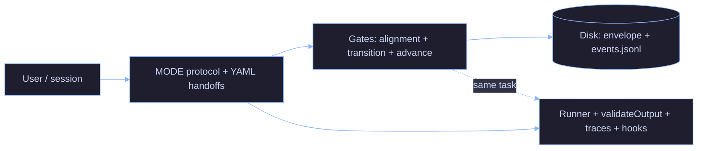

# AI Minions

**AI Minions is not a prompt framework.** It is an **AI execution system** for agent-based workflows: **enforceable structure** (roles and contracts), **validated outputs** (per-role minimums and optional hard gates), **controlled cost** (tokens and context surfaced by hooks), and **traceability** (JSONL traces, disk-backed state when gates are on)—so it is harder to treat “the model agreed” as proof of anything in production.

Most stacks optimize for **capability**. This one optimizes for **control**: fewer unforced errors, fewer hat-swaps in a single reply, and a paper trail when something still goes wrong.

If that sounds like overkill for a weekend script, it probably is. If it sounds like what you wish you had before the last production surprise, keep reading.

---

## Why this exists

- **Prompts do not scale as guarantees.** They steer a model; they do not record what happened or block a bad transition.
- **Multi-agent is expensive** in tokens, wall-clock, and failure modes—you pay for boundaries; you should get **auditability** or **separation of concerns** in return, not a diagram for LinkedIn.
- **Unstructured outputs are not evidence.** “It said it passed” is not a validation run, an artifact list, or a signed-off review.
- **Monolithic agent chats obscure ownership** when implementer, reviewer, and release authority collapse into one stream.

**What ai-minions is for:** governed execution—contracts, gates where you enable them, explicit authority (disk + MCP over transcript when strict mode is on), and telemetry so you can **evaluate** flows instead of **romancing** them.

---

## Core principles

How this maps to practice (not slide-deck values):

| Principle | In this repo |
|-----------|----------------|
| **Delegation** | MODE routing—who plans, who implements, who breaks it, who reviews adversarially—without one process pretending to be all of them. |
| **Description** | Handoffs as **structured data** (YAML contract) plus minimum output shapes; skills are adapters, not the center of gravity. |
| **Discernment** | QA and CERBERUS lanes; goal alignment checks—**and** hard fails when output contracts are unmet (`validateOutput`, blocked `advance_mode`). |
| **Diligence** | Append-only event log, optional artifact allowlists, session metrics on `Stop`, **degraded mode** that says so out loud when gates are off. |

**Governing rule (from ops, not marketing):** *If I do not understand it, I do not ship it.* The repo encodes that as inspectable steps and explicit non-goals—not as cleverer wording in the system prompt.

---

## Quickstart (~2 minutes)

Get from zero to “one skill responds correctly” quickly.

### Prerequisites

- **Cursor** or **Warp** with Claude Code (or compatible agent runtime).
- **Hooks + strict runner (optional):** Node.js ≥ 18 for [`examples/orchestrator/run-orchestrator.js`](examples/orchestrator/run-orchestrator.js); register MCPs per [`examples/orchestrator/README.md`](examples/orchestrator/README.md).
- **Optional (full stack):** MCP servers and CLI tools your skills need — see [`docs/mcp-installation.md`](docs/mcp-installation.md) and the skill you plan to run (e.g. Terraform / Docker linters).

### Install skills

Copy or clone this repo so skills live under `~/.claude/skills/`:

```bash
# Option A: clone directly into ~/.claude
git clone https://github.com/YOUR_USERNAME/ai-minions.git ~/.claude

# Option B: copy only skills
mkdir -p ~/.claude/skills
cp -r /path/to/this/repo/skills/* ~/.claude/skills/
```

Each skill is a folder with a `SKILL.md` (e.g. `~/.claude/skills/reviewing-docker/SKILL.md`).

### Test one skill

In Cursor or Warp, try:

- **“Review this Dockerfile”** (Dockerfile in context) → `reviewing-docker`
- **“Review this Terraform module”** (`.tf` in context) → `reviewing-terraform`
- **“Create a CircleCI pipeline for a Node app”** → `creating-circleci`

Reproducible demos: [`examples/`](examples/).

---

## Usage modes

| Mode | Hard gates? | Best for |
|------|-------------|----------|
| **Skills only** | No | Single-concern tasks: review, scaffold, design |
| **Single-agent orchestration** | No | Multi-step work, one chat, explicit roles (`FLOW: single_agent`) |
| **Strict orchestration** | Yes (when MCPs + runner configured) | Auditable transitions, artifact allowlists (`FLOW: multi_agent` via hook-driven runner) |

### Session header fields

- **`GOAL`** (required for orchestrated modes): plain-language scope for the unit of work. It can be short or several lines; keep it factual (symptoms, constraints, definition of done).
- **`ENVIRONMENT`** (optional): declare **read vs write** and which **logical services** agents may use. Values are **never** pasted in the prompt—only **names of environment variables** that you already set in your shell (or that your launcher injects). If you omit `ENVIRONMENT`, runs stay file- and dry-run–oriented unless the model finds creds another way. Full schema, `type` table, and multi-service examples: [`docs/orchestrator/environment-access.md`](docs/orchestrator/environment-access.md).
- **Shell**: before `run-orchestrator.js` (or any tool that resolves the header), `export` the variables your YAML references (e.g. `$N8N_API_URL`, `$N8N_API_TOKEN`). If a referenced var is missing, the runner logs a warning and agents see **blockers** for missing env in the injected context—nothing fails silently.
- **`CWD`** (optional, typical in `multi_agent`): working directory for the runner; must match the project you want agents to edit.

**Example (generic `GOAL` + optional n8n access via env var names):**

```
MODE: ORCHESTRATOR
FLOW: single_agent
GOAL: Debug and fix the failing automation workflow: execution loops, wrong state transitions, or bad catalog data. Use execution history and prior notes in memory; deliver a minimal fix with evidence.
MAX_ITERATIONS: 3

ENVIRONMENT:
  mode: write
  credentials:
    - name: n8n
      type: api_key
      vars:
        url: N8N_API_URL
        key: N8N_API_TOKEN
```

Same header works with `FLOW: multi_agent`; add `CWD: /path/to/your/project` when using the background runner.

### 1. Skills only

Ask naturally — no MODE header.

```
Review this Dockerfile
```

Skills may spawn subagents (e.g. `reviewing-terraform` → `static-analysis-runner`).

### 2. Single-agent orchestration (`FLOW: single_agent`)

One session rotates roles (ORCHESTRATOR → DEV → QA → CERBERUS, etc.) per the contract. Paste a header at the **start** of your message.

Minimal header (no live APIs):

```
MODE: ORCHESTRATOR
FLOW: single_agent
GOAL: Ship the agreed API change with tests and a short validation note.
MAX_ITERATIONS: 3
```

Same header with **optional** `ENVIRONMENT` (only when you need external services). Shape, `mode`, `credentials`, `type`, and `vars` → [`docs/orchestrator/environment-access.md`](docs/orchestrator/environment-access.md); only **env var names** in YAML, values in your shell — see [Session header fields](#session-header-fields).

```
MODE: ORCHESTRATOR
FLOW: single_agent
GOAL: Ship the agreed API change with tests and a short validation note.
MAX_ITERATIONS: 3

ENVIRONMENT:
  mode: write
  credentials:
    - name: n8n
      type: api_key
      vars:
        url: N8N_API_URL
        key: N8N_API_TOKEN
```

### 3. Strict orchestration (`FLOW: multi_agent`)

Same idea: **`FLOW: multi_agent`** triggers the hook that launches the Node runner so each role can run as a separate `claude` CLI step with disk-backed state and gates (when MCPs are registered). **`ENVIRONMENT`** is still optional — omit it for file-only work; add it under the same contract as above ([`environment-access.md`](docs/orchestrator/environment-access.md)).

Minimal header:

```
MODE: ORCHESTRATOR
FLOW: multi_agent
GOAL: Ship the agreed API change with tests and a short validation note.
MAX_ITERATIONS: 3
CWD: /path/to/your/project
```

With optional **`ENVIRONMENT`** (example — adjust `credentials` to your services):

```
MODE: ORCHESTRATOR
FLOW: multi_agent
GOAL: Ship the agreed API change with tests and a short validation note.
MAX_ITERATIONS: 3
CWD: /path/to/your/project

ENVIRONMENT:
  mode: write
  credentials:
    - name: n8n
      type: api_key
      vars:
        url: N8N_API_URL
        key: N8N_API_TOKEN
```

Watch logs:

```bash
tail -f ~/.claude/logs/orchestrator.log
```

Gate sequence and failure modes: [`docs/orchestrator/strict-mode.md`](docs/orchestrator/strict-mode.md).

### CLI reference runner (`single_agent` vs `multi_agent`)

Direct invocation (bypasses the chat header); use `--skip-gates` until MCPs are installed. The first argument is the **same text** you would paste in chat: you can pass **only** a `GOAL` sentence, or a **full header** including optional `ENVIRONMENT` / `CWD`. The runner parses `ENVIRONMENT` from that string — see [Session header fields](#session-header-fields) and [`docs/orchestrator/environment-access.md`](docs/orchestrator/environment-access.md). Export the referenced variables before running.

```bash
# Goal text only (no ENVIRONMENT)
node ~/.claude/examples/orchestrator/run-orchestrator.js \
  --cwd /path/to/project \
  --flow single_agent \
  --skip-gates \
  "Ship the agreed API change with tests and a short validation note."

# Full header + ENVIRONMENT (newlines inside the quoted string).
# Set N8N_API_URL and N8N_API_TOKEN in your shell (or CI secrets) before running — never in the repo.
node ~/.claude/examples/orchestrator/run-orchestrator.js \
  --cwd /path/to/project \
  --flow multi_agent \
  --skip-gates \
  "MODE: ORCHESTRATOR
FLOW: multi_agent
GOAL: Ship the agreed API change with tests and a short validation note.
MAX_ITERATIONS: 3

ENVIRONMENT:
  mode: write
  credentials:
    - name: n8n
      type: api_key
      vars:
        url: N8N_API_URL
        key: N8N_API_TOKEN"
```

Full flags, degraded mode, and MCP setup: [`examples/orchestrator/README.md`](examples/orchestrator/README.md). Cursor rule (MODE non‑negotiables): [`.cursor/rules/orchestrator.mdc`](.cursor/rules/orchestrator.mdc) — install elsewhere with `./scripts/install-orchestrator-rule.sh /path/to/repo`.

### Anti-loop (reminder)

- QA returns to DEV only for **`blocker`** findings; other severities go to backlog.
- If `iteration >= max_iterations`, escalate to **ORCHESTRATOR**, not another blind DEV round.

---

## Core concepts (technical vocabulary)

| Concept | What it is in this repo |
|--------|-------------------------|
| **Agents (roles)** | Fixed **MODE**s (`ORCHESTRATOR`, `OWNER`, `ARCHITECT`, `DEV`, `QA`, `CERBERUS`) with explicit **FORBID** rules so one hat cannot substitute for another. See [`docs/orchestrator/agent-contract.md`](docs/orchestrator/agent-contract.md). |
| **Contracts** | **Structured handoffs** (YAML schema) plus **per-role output contracts** in strict execution: minimum content and shape before a step counts as done. |
| **Gates** | **Hard checks** before a MODE advance: goal alignment, transition validation, approved artifacts vs `files_modified`. Implemented via the **`orchestrator-state`** MCP and an append-only **hash-chained** event log—not the chat. |
| **Orchestration** | **Single-agent** (`FLOW: single_agent`): one session, disciplined role switching. **Multi-agent** (`FLOW: multi_agent`): separate processes per role via the reference runner and hooks. Same protocol; different cost and isolation trade-offs. |
| **Context efficiency** | Deliberate limits on what crosses step boundaries (e.g. `AI_TEAM_MAX_CONTEXT_CHARS`), **context_stats** (files read / modified counts) attached to validation, and a **`context-budget`** skill for auditing context bloat. |
| **Traceability** | **JSONL execution traces** under `~/.claude/metrics/traces/` (session start, agent lifecycle, contract failures, gate results, `context_stats`, session end). Hooks aggregate **tokens, cost, and MODE** into session summaries on `Stop`. |

Skills and hooks still exist—they are **adapters and sensors** around this core, not the definition of the system.

---

## What makes this different

- **Not a LangChain clone, not CrewAI, not “agents because agents.”** Same category of noise this repo argues against: capability demos without **accountability** for what executed and who approved it.
- **Most agent frameworks default to “more autonomy.”** Here the default posture is **less silent failure**: output contracts, optional gates, and telemetry instead of a single transcript pretending to be a log.
- **Authority is explicit:** when strict orchestration is enabled, **disk + MCP** define what happened; the transcript is commentary.

Reference implementation and gate semantics: [`examples/orchestrator/README.md`](examples/orchestrator/README.md). State store layout and tools: [`mcp-servers/orchestrator-state/README.md`](mcp-servers/orchestrator-state/README.md).

---

## Experiments and metrics

The point is not a leaderboard—it is **evidence you can own**: same `GOAL`, different `FLOW`, same hooks writing tokens/cost/MODE summaries and traces capturing contract failures, gate results, and `context_stats`.

**What the machinery records today**

- **`FLOW`** as a label (`single_agent` | `multi_agent`) so runs are comparable under the same goal.
- **Hooks** (`session-state`, `flow-metrics`, `agent-metrics`): tokens, cost, handoffs, goal-alignment summaries.
- **Traces** (`~/.claude/metrics/traces/`): per-step failures, gate pass/fail, `qa_degraded`, `context_stats`.

**Status of SA vs MA comparisons**

Single-agent paths have more **informal** mileage in day-to-day use. **Multi-agent evaluation is still incomplete** (test matrix and workloads not closed). Any side-by-side observation you make with this repo should be read as **directional and provisional**—hypothesis-generating, not a proof that one flow “beats” the other. When MA tests are complete, numbers and conclusions belong next to the methodology that produced them, not in a slogan.

Order-of-magnitude timings and gate trade-offs (e.g. `--skip-gates` vs full MCP path) are documented in [`examples/orchestrator/README.md`](examples/orchestrator/README.md). **No fabricated benchmark tables here:** hardware, model choice, and task shape dominate outcomes.

---

## Architecture (compressed)

The diagram below is **intentionally minimal**: roles → handoffs → gates → authoritative disk → execution and telemetry. For the **full internal wiring** (skills, each hook, Ollama/OpenMemory, external MCPs, legend), see [`docs/orchestrator/system-architecture-diagram.md`](docs/orchestrator/system-architecture-diagram.md).



Strict-mode operations (register task, artifact allowlists, gate order): [`docs/orchestrator/strict-mode.md`](docs/orchestrator/strict-mode.md).

---

## What this is NOT (non-goals)

- **Not fully autonomous “AI engineering.”** Humans still own scope, risk, and ship decisions.
- **Not a replacement for engineers**—a structure for how agents are run and reviewed, not a headcount argument.
- **Not prompt-engineering magic**—if the contract and gates are wrong, the system fails in the open instead of cosplaying rigor.
- **Not a promise of session isolation from metadata alone**—see **§ Authoritative state** in [`docs/orchestrator/agent-contract.md`](docs/orchestrator/agent-contract.md): `session_id` is audit metadata until a dedicated runner enforces real isolation.

---

## Repository map (after you understand the thesis)

| Area | Purpose |
|------|---------|
| [`docs/orchestrator/agent-contract.md`](docs/orchestrator/agent-contract.md) | Roles, handoff YAML, state-store authority, output contracts. |
| [`docs/orchestrator/system-architecture-diagram.md`](docs/orchestrator/system-architecture-diagram.md) | Full operational Mermaid (skills, hooks, MCPs, disk, Ollama). |
| [`examples/orchestrator/`](examples/orchestrator/) | Node reference runner: planning, `validateOutput`, MCP gates, traces. |
| [`mcp-servers/orchestrator-state/`](mcp-servers/orchestrator-state/) | Disk-backed task store + gate MCP (pytest included). |
| [`mcp-servers/compact-handoff/`](mcp-servers/compact-handoff/) | Handoff compaction + alignment helpers (local). |
| [`scripts/hooks/`](scripts/hooks/) | Claude Code lifecycle: launch multi-agent runner, token/cost/MODE tracking, session summaries. |
| [`skills/`](skills/) | Task-scoped playbooks (Terraform, Docker, CI, n8n, observability, specs, …). |
| [`agents/`](agents/) | Specialized subagent definitions consumed by skills and workflows. |

Hook wiring: copy [`settings.json.example`](settings.json.example) to your local `settings.json` and adapt paths (do not commit secrets).

---

## Safety and scope

- **Read vs write:** skills that generate files do not imply `terraform apply`, production deploys, or unprompted pushes—human action stays in the loop.
- **Secrets:** never paste credentials into prompts; use environment variables or your platform’s secret store.

---

## License and contributing

- [MIT](LICENSE)
- [CONTRIBUTING.md](CONTRIBUTING.md)

---

*A technical stance on how agent-heavy work should be run—not how to write a prettier prompt.*
