# AI Minions 🍌

A collection of AI skills, agents, and orchestration tools for Claude Code — compatible with Cursor and Warp.

---

## 🔧 Quickstart (90 seconds)

Get from zero to "one skill works" in under two minutes.

### Prerequisites

- **Cursor** or **Warp** with Claude Code / Oz agents enabled
- (Optional, for full feature set) MCP servers and CLI tools listed in [MCP Servers Required](#mcp-servers-required) and [CLI Tools](#cli-tools)

### Install skills

Copy or clone this repo so that skills live under `~/.claude/skills/`:

```bash
# Option A: clone directly into ~/.claude
git clone https://github.com/YOUR_USERNAME/ai-minions.git ~/.claude

# Option B: copy only skills
mkdir -p ~/.claude/skills
cp -r /path/to/this/repo/skills/* ~/.claude/skills/
```

Ensure each skill is in its own folder with a `SKILL.md` (e.g. `~/.claude/skills/reviewing-docker/SKILL.md`).

### Test one skill

In Cursor or Warp, ask:

- **"Review this Dockerfile"** (with a Dockerfile open) → should trigger `reviewing-docker`
- **"Review this Terraform module"** (with `.tf` files in context) → should trigger `reviewing-terraform`
- **"Create a CircleCI pipeline for a Node app"** → should trigger `creating-circleci`
- **"Design the spec to apply AIOps to repo X"** or **"Epic and tickets for adding observability"** → should trigger `feature-spec-and-tasks`

If the model mentions the skill or follows its instructions, the skill is active. See [Examples](#examples) for reproducible demos.

---

## Usage modes

Three ways to use this repo — pick the one that fits your task.

| Mode | Uses MCP? | Hard gates? | Best for |
|------|-----------|-------------|----------|
| **Skills only** | Optional (external MCPs) | No | Single-concern tasks: review, create, design |
| **Single-agent orchestration** | `compact-handoff` | Soft (prompt discipline) | Multi-step work with explicit role separation |
| **Strict orchestration** | `compact-handoff` + `orchestrator-state` | Yes (disk-backed, tamper-evident) | Production, compliance, or any flow where "the chat said so" is not enough |

---

### 1. Skills only (no orchestration)

Just ask. Skills activate by intent — no setup required.

```
Review this Dockerfile
```
```
Create a CircleCI pipeline for a Node app
```
```
Design the Terraform architecture for an API + RDS setup
```

Skills run inline in the current chat. They may spawn specialized subagents automatically (e.g. `reviewing-terraform` spawns `static-analysis-runner`). No MODE declaration needed.

**When to use:** Single-concern tasks — review, create, design — where you don't need role separation or iteration tracking.

---

### 2. Single-agent orchestration (multi-role, one chat)

Declare the session header and the model switches roles within the same chat.

```
MODE: ORCHESTRATOR
FLOW: single_agent
GOAL: add billing module to the API
MAX_ITERATIONS: 3
```

The orchestrator decomposes the goal, assigns the first MODE, and enforces handoffs:

```
→ ORCHESTRATOR plans and assigns: execute MODE: DEV
→ DEV implements, calls compact_handoff at the end
→ ORCHESTRATOR validates alignment, advances to QA
→ QA reviews, classifies findings (blocker / improvement / nice-to-have)
→ ORCHESTRATOR advances to CERBERUS or closes
```

Each MODE transition requires a handoff via MCP:

```
mcp__compact-handoff__compact_handoff(
  text="<full DEV output>",
  mode_completed="DEV",
  next_mode="QA",
  flow_mode="single_agent"
)
```

**When to use:** Non-trivial tasks where you want explicit role separation and anti-loop enforcement, but don't need a separate process per role.

---

### 3. Strict orchestration (state store + hard gates)

Same as mode 2, but the `orchestrator-state` MCP is the authority. Every transition is recorded on disk (`envelope.json` + `events.jsonl`) and gated — unapproved files and unaligned goals block `advance_mode` before QA or CERBERUS can run.

```
MODE: ORCHESTRATOR
FLOW: single_agent
GOAL: migrate auth middleware to comply with new session policy
MAX_ITERATIONS: 3
```

Gate sequence per transition: `register_task` → `compact_handoff` → `validate_goal_alignment` → `validate_transition` → `advance_mode` → `close_task`.

**When to use:** Production work, compliance-sensitive tasks, or any flow where "the chat said so" is not enough.

Full call syntax, envelope/events examples, and failure cases: [`docs/orchestrator/strict-mode.md`](docs/orchestrator/strict-mode.md).

---

## How it works

```mermaid
%%{init: {"theme": "base", "themeVariables": {"primaryColor": "#1e1e2e", "primaryTextColor": "#cdd6f4", "primaryBorderColor": "#89b4fa", "lineColor": "#89b4fa", "secondaryColor": "#181825", "tertiaryColor": "#313244", "edgeLabelBackground": "#313244", "clusterBkg": "#181825", "clusterBorder": "#45475a", "titleColor": "#cdd6f4", "fontFamily": "monospace"}}}%%
flowchart LR

    %% ── Input ────────────────────────────────────────────────────────────
    U([🧑 User Prompt]):::user

    %% ── Skills ───────────────────────────────────────────────────────────
    subgraph Skills ["⚡ Skills  •  skills/"]
        direction TB
        SK[Skill\ntriggered by intent]:::skill
        SA[Specialized Subagent]:::skill
        SK -.->|spawns| SA
    end

    U ==> SK

    %% ── Hooks (lifecycle, vertical strip on the left) ────────────────────
    subgraph Hooks ["🪝 Hooks  •  scripts/hooks/"]
        direction TB
        H1[mem0-search\nUserPromptSubmit]:::hook
        H2[session-state · agent-metrics\nPostToolUse]:::hook
        H3[flow-metrics · mem0-stop\nStop]:::hook
    end

    U -.->|lifecycle| H1

    %% ── Orchestrator ─────────────────────────────────────────────────────
    subgraph Orch ["🎭 Orchestrator Protocol"]
        direction TB
        ORC[ORCHESTRATOR\ndeclares MODE + GOAL]:::orch
        DEV[DEV\nImplement]:::mode
        QA[QA\nBreak it]:::mode
        CER[CERBERUS\nAdversarial review]:::mode
        ORC ==> DEV
        DEV ==>|handoff YAML| QA
        QA ==>|handoff YAML| CER
        QA -.->|blocker only| DEV
        CER -.->|another round| DEV
    end

    SK ==> ORC
    SA -.->|uses| Ext

    %% ── compact-handoff ──────────────────────────────────────────────────
    CH["🔌 compact-handoff\ncompact_handoff → YAML\nvalidate_goal_alignment"]:::mcp

    DEV -->|full output| CH
    QA  -->|full output| CH
    CER -->|full output| CH
    CH  -->|handoff YAML| ORC

    %% ── Task boundary (state store + gates) ──────────────────────────────
    subgraph Task ["📋 Task Boundary  •  task_id"]
        direction TB

        subgraph Gates ["🔌 orchestrator-state MCP"]
            direction TB
            GT_R[register_task\nrecord_artifact]:::mcp
            GT_V{"validate_transition\nvalidate_goal_alignment"}:::gate
            GT_A[advance_mode]:::mcp
            GT_R --> GT_V
            GT_V -->|"🟩 PASS"| GT_A
            GT_V -->|"🟥 BLOCK"| ORC
        end

        subgraph Store ["💾 Disk  •  ~/.claude/.state/orchestrator/"]
            direction TB
            F1["envelope.json\ngoal · mode · artifacts"]:::store
            F2["events.jsonl\nappend-only · hash chain"]:::store
        end

        GT_A --> F1
        GT_A --> F2
    end

    ORC -.->|register / advance| GT_R
    ORC -.->|validate| GT_V
    GT_A -.->|current_mode| ORC
    ORC -.->|PostToolUse| H2
    ORC -.->|Stop| H3

    %% ── Ollama ───────────────────────────────────────────────────────────
    subgraph OLLAMA ["🦙 Ollama  (local LLM)"]
        OL[qwen2.5-coder:7b\nnomic-embed-text]:::ollama
        MEM[(OpenMemory\nQdrant)]:::ollama
        OL -->|embeddings| MEM
    end

    CH  -.->|alignment check| OL
    GT_V -.->|alignment check| OL
    H1  ---  MEM

    %% ── External MCPs ────────────────────────────────────────────────────
    subgraph Ext ["🌐 External MCPs  (optional)"]
        direction TB
        E1[terraform-mcp-server]:::ext
        E2[aws-diagram-mcp-server]:::ext
        E3[n8n-mcp · drawio]:::ext
    end

    %% ── Legend ───────────────────────────────────────────────────────────
    subgraph Legend ["Legend"]
        direction LR
        LD1[ ]:::spacer
        LD2[ ]:::spacer
        LD1 ==>|data flow| LD2
        LD3[ ]:::spacer
        LD4[ ]:::spacer
        LD3 -.->|control flow| LD4
    end

    classDef user    fill:#f38ba8,stroke:#f38ba8,color:#1e1e2e,font-weight:bold
    classDef skill   fill:#a6e3a1,stroke:#a6e3a1,color:#1e1e2e
    classDef orch    fill:#cba6f7,stroke:#cba6f7,color:#1e1e2e,font-weight:bold
    classDef mode    fill:#89b4fa,stroke:#89b4fa,color:#1e1e2e
    classDef mcp     fill:#fab387,stroke:#fab387,color:#1e1e2e
    classDef gate    fill:#f38ba8,stroke:#f38ba8,color:#1e1e2e,font-weight:bold
    classDef ollama  fill:#f9e2af,stroke:#f9e2af,color:#1e1e2e
    classDef hook    fill:#94e2d5,stroke:#94e2d5,color:#1e1e2e
    classDef ext     fill:#45475a,stroke:#6c7086,color:#cdd6f4
    classDef store   fill:#313244,stroke:#585b70,color:#cdd6f4
    classDef spacer  fill:none,stroke:none,color:transparent
```



---

## 🧠 Orchestrator (multi-role protocol)

The orchestrator enforces **MODE-based role separation** to prevent a single agent from mixing implementation, review, and critique in the same response — the main source of quality degradation in single-agent setups.

### MODEs

| MODE | Role |
|------|------|
| `ORCHESTRATOR` | Decomposes goals, assigns next MODE, enforces handoffs |
| `OWNER` | Scope, priorities, definition of done |
| `ARCHITECT` | Design, trade-offs, diagrams — no code |
| `DEV` | Implementation only — no self-review |
| `QA` | Break it, edge cases, evidence — no production code |
| `CERBERUS` | Adversarial last-mile review after DEV+QA — no fixes in same turn |

### Session header (ORCHESTRATOR — first response)

```text
MODE: ORCHESTRATOR
FLOW: single_agent | multi_agent
GOAL: <one line — what will be accomplished>
MAX_ITERATIONS: 3
```

`FLOW` tags the architecture for benchmarking. All handoffs in the session inherit `flow_mode` from this.

### Handoff via MCP (required at every MODE transition)

Instead of writing handoff YAML by hand, every MODE calls the local `compact-handoff` MCP server:

```
mcp__compact-handoff__compact_handoff(
  text="<full MODE output>",
  mode_completed="DEV",
  next_mode="QA",
  flow_mode="single_agent"
)
```

The MCP uses a local Ollama model (qwen2.5-coder:7b) to extract and structure the handoff — no cloud API cost for coordination.

ORCHESTRATOR then validates alignment before advancing:

```
mcp__compact-handoff__validate_goal_alignment(
  handoff_yaml="<yaml>",
  goal="<session GOAL>",
  flow_mode="single_agent"
)
```

If `aligned: false` → ORCHESTRATOR does not advance MODE.

For **hard gates** (disk-backed transitions, approved path lists, persisted alignment), add the **`orchestrator-state`** MCP: `register_task` → `record_artifact` → `compact_handoff` → **`orchestrator-state`** `validate_goal_alignment` (persists status) → `validate_transition` → **`advance_mode`**. Details: [`mcp-servers/orchestrator-state/README.md`](mcp-servers/orchestrator-state/README.md) and the contract § *Authoritative state (L2)*.

### Anti-loop

- QA only returns to DEV with `blocker` findings. `improvement` and `nice-to-have` go to backlog.
- If `iteration >= max_iterations` → escalate to ORCHESTRATOR, not another DEV round.

### Paths (repo-relative, clone anywhere)

| What | Path |
|------|------|
| Agent contract + skills | [`docs/orchestrator/agent-contract.md`](docs/orchestrator/agent-contract.md) |
| MCP / subagent examples | [`docs/orchestrator/mcp-task-examples.md`](docs/orchestrator/mcp-task-examples.md) |
| Cursor rule | [`.cursor/rules/orchestrator.mdc`](.cursor/rules/orchestrator.mdc) |
| Paths & conventions | [`docs/orchestrator/PATHS.md`](docs/orchestrator/PATHS.md) |

Install rule into another repo: `./scripts/install-orchestrator-rule.sh /path/to/repo`.

---

## 🪝 Hooks

Claude Code hooks that run automatically during sessions:

| Hook | Event | What it does |
|------|-------|--------------|
| `mem0-search.py` | `UserPromptSubmit` | Semantic memory retrieval from local OpenMemory (Qdrant + Ollama) |
| `session-state.py` | `PostToolUse` | Live session state: tokens, cost, MODE, agent calls |
| `agent-metrics.py` | `PostToolUse` (Agent) | Per-subagent token usage, duration, tool count |
| `mem0-stop.sh` | `Stop` | Reminds to save memories to OpenMemory |
| `flow-metrics.py` | `Stop` | Session summary: tokens/cost per MODE, DEV→QA cycles, handoff count, goal alignment |

Configure hooks in `settings.json` (see `settings.json` at repo root — copy and adapt, do not commit your local version).

### Flow metrics output (`~/.claude/metrics/flow-metrics.jsonl`)

Each session appends one record:

```json
{
  "flow_mode": "single_agent",
  "session_goal": "...",
  "phases": [{"mode": "DEV", "turns": 4, "input_tokens": 12000, "output_tokens": 3200}],
  "dev_qa_cycles": 1,
  "handoff_count": 3,
  "goal_aligned_count": 2,
  "blockers_found": 1,
  "cost_usd": 0.42
}
```

This is the raw data for the **single-agent vs multi-agent benchmark**.

---

## 🤖 compact-handoff MCP server

Local MCP server (`mcp-servers/compact-handoff/`) that compacts agent outputs and validates goal alignment using a local Ollama model.

### Setup

```bash
# Requires: uv, Ollama with qwen2.5-coder:7b pulled
cd mcp-servers/compact-handoff
uv sync --no-install-project

# Register with Claude Code
claude mcp add compact-handoff \
  /absolute/path/to/.venv/bin/python \
  /absolute/path/to/mcp-servers/compact-handoff/server.py \
  --scope user
```

### Tools

| Tool | Purpose |
|------|---------|
| `compact_handoff` | Compacts raw MODE output → structured handoff YAML |
| `classify_finding` | Classifies a QA finding as `blocker / improvement / nice-to-have` |
| `validate_goal_alignment` | Validates handoff against session goal, returns `aligned: true/false` |

---

## Skills

### Terraform

| Skill | Trigger | What it does |
|---|---|---|
| `designing-terraform` | "design", "architect", "plan", "evaluate infrastructure" | Explores AWS architecture options, compares trade-offs, generates diagrams and documentation (design docs, ADRs, component lists). No code — only decisions and docs. |
| `creating-terraform` | "create", "scaffold", "generate terraform component" | Scaffolds directory structure, generates HCL using MCP provider docs, validates with `terraform fmt` + `validate`. Follows team conventions (S3 backend, default_tags, terrarium modules). |
| `reviewing-terraform` | "review", "audit", "check terraform" | Runs tflint + trivy, validates structure/naming, checks resources against MCP provider docs. Three-phase review: static analysis, structure, provider validation. |

**Workflow**: `designing-terraform` → `creating-terraform` → `reviewing-terraform`

### Docker

| Skill | Trigger | What it does |
|---|---|---|
| `reviewing-docker` | "review", "check", "audit dockerfile" | Runs hadolint (linting) + docker build --check (syntax) + trivy (security/vulnerabilities). Reviews code quality and security best practices. |

### Observability

| Skill | Trigger | What it does |
|---|---|---|
| `configuring-observability` | "configure otel", "create grafana dashboard", "observability setup" | Creates OTEL collector configs and Grafana dashboards. Cloud-agnostic (Prometheus, CloudWatch, Datadog, Loki, Tempo). Cross-signal validation between collector and dashboards. |

### n8n

| Skill | Trigger | What it does |
|---|---|---|
| `managing-n8n` | "create", "review", "optimize", "document n8n workflow" | Creates workflow JSON from requirements, validates structure/connections/error handling, optimizes performance and patterns, generates documentation and flow diagrams. Parallel agents for review. |

### CI/CD

| Skill | Trigger | What it does |
|---|---|---|
| `creating-circleci` | "create", "scaffold circleci pipeline" | Gathers requirements interactively and generates CircleCI 2.1 configs from templates. Separate app and infra workflows when needed. |
| `reviewing-circleci` | "review", "check circleci config" | Static analysis of `.circleci/config.yml` — structure, security, optimization, best practices. No API access needed. |

### Feature specs (Kiro-style)

| Skill | Trigger | What it does |
|---|---|---|
| `feature-spec-and-tasks` | "design spec for initiative", "apply X to repo", "epic and tickets", "plan with tasks" | One spec doc with requirements (EARS), design, and discrete tasks (tickets) with prerequisites and steps. |

**Workflow**: spec-writer → single doc (requirements + design + tasks + before executing).

### Diagrams

| Skill | Trigger | What it does |
|---|---|---|
| `creating-diagrams` | "architecture diagram", "flow diagram", "diagram with AWS icons" | Creates diagrams: **Mermaid** (embedded in Markdown) or **PNG with real icons** via `awslabs.aws-diagram-mcp-server`. |

### Orchestration

| Skill | Trigger | What it does |
|---|---|---|
| `contracts-with-llm` | "LLM contract", "structured output", "API contract for AI" | Defines structured contracts between agents or LLM calls. |
| `audit-patterns` | "audit patterns", "detect patterns in history" | Detects recurring patterns across sessions for process improvement. |
| `git-best-practices` | "git", "branch", "PR", "commit" | Branch naming, PR structure, commit conventions. |
| `prepare-context-clear` | "prepare context", "clear context" | Compresses and structures context before starting a long session. |
| `proposal-*` | "proposal", "refine proposal", "review proposal" | Proposal drafting, refinement, review, and synthesis. |

---

## Shared Agents

| Agent | Activates when | Used by |
|---|---|---|
| `network-validator` | VPCs, subnets, peering, TGW, DNS | designing/creating/reviewing-terraform |
| `compliance-checker` | `.compliance.yaml` exists or framework declared | terraform, docker, observability, n8n |
| `infra-documenter` | Non-obvious decisions needing persistent docs | designing-terraform (always), others |

---

## MCP Servers Required

| MCP Server | Used by | Purpose |
|------------|---------|---------|
| `terraform-mcp-server` (HashiCorp) | creating/reviewing/designing-terraform | Resource/module docs lookup |
| `awslabs.terraform-mcp-server` | creating/reviewing/designing-terraform, compliance-checker | AWS best practices, provider docs, checkov |
| `awslabs.aws-diagram-mcp-server` | designing-terraform, infra-documenter, creating-diagrams | Architecture PNG with real icons |
| `drawio` | creating-diagrams, infra-documenter | Draw.io editor (optional) |
| `n8n-mcp` | managing-n8n | Node schemas, validation, workflow operations |
| `compact-handoff` (this repo) | ORCHESTRATOR, all MODEs | Local handoff compaction + goal validation via Ollama |
| `orchestrator-state` (this repo) | ORCHESTRATOR, strict L2 flow | Authoritative disk store, append-only events, gates: `advance_mode`, `validate_transition`, `record_artifact` |

---

## CLI Tools

| Tool | Used by | Install |
|---|---|---|
| `hadolint` | reviewing-docker | [github.com/hadolint/hadolint](https://github.com/hadolint/hadolint/releases) |
| `trivy` | reviewing-docker, reviewing-terraform | [aquasecurity/trivy](https://github.com/aquasecurity/trivy) |
| `tflint` | reviewing-terraform | [terraform-linters/tflint](https://github.com/terraform-linters/tflint) |
| `terraform` | creating-terraform, reviewing-terraform | [developer.hashicorp.com/terraform](https://developer.hashicorp.com/terraform/install) |
| `ollama` | compact-handoff MCP, orchestrator-state `validate_goal_alignment`, mem0-search hook | [ollama.com](https://ollama.com) — pull `qwen2.5-coder:7b` and `nomic-embed-text` |
| `uv` | MCP servers in `mcp-servers/*` | [docs.astral.sh/uv](https://docs.astral.sh/uv) |

---

## Structure

```
~/.claude/                           # clone this repo here
├── agents/                          # Subagent definitions for Claude Code
├── docs/
│   ├── orchestrator/                 # Orchestrator contract and examples
│   │   ├── agent-contract.md       # Full MODE protocol, handoff schema, anti-loop rules
│   │   ├── mcp-task-examples.md     # MCP/subagent usage examples
│   │   ├── CURSOR_RULE_SETUP.md     # How to install the Cursor rule in other repos
│   │   └── PATHS.md                 # Path conventions for multi-repo setups
│   ├── drawio-mcp-setup.md          # Draw.io MCP server setup guide
│   └── mcp-installation.md          # General MCP installation guide
├── examples/                        # Reproducible demos (input + expected output)
├── mcp-servers/
│   ├── compact-handoff/             # Local MCP: handoff compaction + goal validation
│   │   ├── server.py                # compact_handoff, classify_finding, validate_goal_alignment
│   │   └── pyproject.toml
│   └── orchestrator-state/          # L2: authoritative store + transition gates
│       ├── server.py                # register_task, advance_mode, validate_*, record_artifact, …
│       ├── tests/                   # pytest (no Ollama; mocked alignment)
│       ├── README.md
│       └── pyproject.toml
├── scripts/
│   ├── hooks/                       # Claude Code hooks
│   │   ├── mem0-search.py           # UserPromptSubmit: semantic memory retrieval
│   │   ├── session-state.py         # PostToolUse: live tokens/cost/MODE tracking
│   │   ├── agent-metrics.py         # PostToolUse(Agent): per-subagent metrics
│   │   ├── mem0-stop.sh             # Stop: reminder to save memories
│   │   └── flow-metrics.py          # Stop: session summary + benchmark data
│   ├── install-orchestrator-rule.sh
│   ├── test-orchestrator-state.sh   # pytest for orchestrator-state MCP
│   └── openmemory-start.sh          # Start local OpenMemory (Qdrant + Ollama)
├── skills/                          # Skill definitions (one folder per skill)
│   ├── audit-patterns/
│   ├── configuring-observability/
│   ├── context-budget/
│   ├── contracts-with-llm/
│   ├── creating-circleci/
│   ├── creating-diagrams/
│   ├── creating-terraform/
│   ├── designing-terraform/
│   ├── feature-spec-and-tasks/
│   ├── git-best-practices/
│   ├── managing-n8n/
│   ├── prepare-context-clear/
│   ├── proposal-refine/
│   ├── proposal-review/
│   ├── proposal-synthesize/
│   ├── reviewing-circleci/
│   ├── reviewing-docker/
│   └── reviewing-terraform/
├── .cursor/
│   └── rules/
│       └── orchestrator.mdc  # Cursor rule — MODE non-negotiables
├── .gitignore
├── settings.json.example            # Hook config template — copy to settings.json and adapt
└── README.md
```

---

## Examples

The [`examples/`](examples/) folder contains **reproducible demos** with sample input and expected behavior:

| Demo | Input | Expected outcome |
|------|--------|------------------|
| [Review Terraform module](examples/review-terraform-module.md) | Sample `.tf` or module path | tflint/trivy + structure + provider validation report |
| [Review Dockerfile](examples/review-dockerfile.md) | Sample Dockerfile | hadolint + build check + trivy findings + best-practice notes |
| [Create CircleCI pipeline](examples/create-circleci-pipeline.md) | App type + requirements | Generated `.circleci/config.yml` |

---

## Safety & scope

- **Read-only vs write**: Most skills are read-heavy. Skills that write (e.g. `creating-terraform`) generate files — they do not run `terraform apply` or deploy without your explicit action.
- **No production executions**: Never ask the model to run `apply`, `destroy`, or production deploys without a `plan` step first.
- **Sensitive data**: Never paste API keys, tokens, or passwords into chats. Use env vars or secret managers.
- **settings.json**: Contains local hook paths. Add to `.gitignore` — the repo provides it as a reference only.

---

## CI

| Workflow | Purpose |
|----------|---------|
| Markdown lint | Consistent formatting |
| Link check | Ensures URLs do not 404 |

See [`.github/workflows/`](.github/workflows/).

---

## License & contributing

- **License**: [MIT](LICENSE)
- **Contributing**: See [CONTRIBUTING.md](CONTRIBUTING.md)

---

*Because even AI needs its minions* 🦹‍♂️
