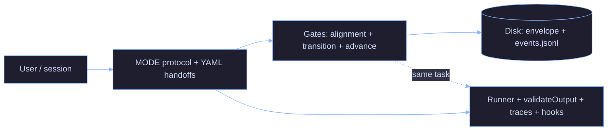

# AI Minions

AI coding workflows fail because they optimize output, not process.

This repo treats AI as a **structured engineering system**: contracts, gates, and measurable signals—so its behavior is **observable, reproducible, and debuggable**.

The goal is not to make AI feel smarter. It is to make it **harder to approve something you do not understand**—because that is exactly how broken systems get shipped.

> *Si no lo entiendo, no lo apruebo.* — If I don't understand it, I don't approve it.
> Most production incidents start with someone doing exactly the opposite.

---

## Why this exists

The default agent stack is structurally unsafe for anything that actually matters in production—and that is exactly where people are starting to use it:

| Failure mode | Why it burns you |
|---|---|
| **Prompt engineering at scale** | Instructions drift; nobody can replay *why* a decision counted. |
| **Naive multi-agent** | Cost explodes; you still have no gate on "did this transition actually happen?" |
| **Unvalidated outputs** | Confident prose with no artifact list, no test output, no blocked advance. |
| **No role separation** | One chat mixes author, reviewer, and release narrative. Accountability collapses. |

---

## Philosophy

AI systems should be treated as engineering systems, not collaborators.

- Outputs are not trusted — they are validated
- Roles are not blended — they are isolated
- Progress is not assumed — it is gated
- Cost is not ignored — it is measured

---

## How it works

Three control layers:

**1. Roles and contracts** — Fixed MODEs (`ORCHESTRATOR`, `OWNER`, `ARCHITECT`, `DEV`, `QA`, `CERBERUS`) with explicit FORBID rules and structured YAML handoffs. One role per response; no self-review. Full contract: [`docs/orchestrator/agent-contract.md`](docs/orchestrator/agent-contract.md).

**2. Validation** — Every agent step is checked by `validateOutput()` against a role contract. Failures are explicit (`gate_id`). No silent pass. When MCPs are enabled, `orchestrator-state` enforces transitions on disk—the transcript does not override the log.

**3. Observability** — Hooks write token/cost/MODE summaries per session and per phase. Traces record contract failures, gate results, and blocker counts. Same `GOAL`, different `FLOW` → diff the files.

Full wiring: [`docs/orchestrator/system-architecture-diagram.md`](docs/orchestrator/system-architecture-diagram.md).

---

## What makes this different

- Contracts are **enforced**, not suggested
- Transitions are **gated**, not assumed
- Failures are **recorded**, not hidden
- Comparisons are based on **traces**, not impressions
- Degraded mode is **loud**, not silent

---

## Quickstart

**Prerequisites:** Cursor or Warp with Claude Code. Node.js ≥ 18 for the strict runner (optional). MCP servers and CLI tools per the skill you use—see [`docs/mcp-installation.md`](docs/mcp-installation.md).

**Install:**

```bash
git clone https://github.com/YOUR_USERNAME/ai-minions.git ~/.claude
```

**Test a skill** (no header needed):

```
Review this Dockerfile
```

**Run orchestrated work** (paste at the start of any chat):

```
MODE: ORCHESTRATOR
FLOW: single_agent
GOAL: <your goal here>
MAX_ITERATIONS: 3
```

Add `FLOW: multi_agent` + `CWD: /path/to/project` for the hook-driven background runner. Add an optional `ENVIRONMENT` block when agents need live service access—credentials as **env var names only**, never values. Full schema: [`docs/orchestrator/environment-access.md`](docs/orchestrator/environment-access.md).

```
ENVIRONMENT:
  mode: write
  credentials:
    - name: n8n
      type: api_key
      vars:
        url: N8N_API_URL
        key: N8N_API_TOKEN
```

Watch logs: `tail -f ~/.claude/logs/orchestrator.log`. Gate sequence: [`docs/orchestrator/strict-mode.md`](docs/orchestrator/strict-mode.md). CLI flags and degraded mode: [`examples/orchestrator/README.md`](examples/orchestrator/README.md).

---

## Experiments and metrics

Three evidence classes. Same `GOAL`, different `FLOW` → diff the files, not the chat.

| Signal class | What it measures | Where it lives |
|---|---|---|
| **Cost** | Tokens and USD per session, per phase, per MODE | `flow-metrics.jsonl` (hook on `Stop`) |
| **Control failures** | `contract_fail`, `gate_result: false`, `degraded_mode` | `traces/<task_id>.jsonl` |
| **Runtime defects** | QA/CERBERUS findings, blocker counts, `validation_run` output | Handoffs + `cerberus_check` trace events |

**Interpretation rule:** if you cannot explain the delta between two runs using these three signals, the comparison is invalid.

### Status — SA vs MA

| `FLOW` | State |
|---|---|
| `single_agent` | Primary usage — multiple runs. |
| `multi_agent` | **Incomplete** — 1 run, ended with errors. SA vs MA comparisons are directional only. |

---

## Core principles (Anthropic AI Fluency 4D)

The four competency names come from Anthropic's **AI Fluency** framework (© 2025 Rick Dakan, Joseph Feller, and Anthropic — CC BY-NC-SA 4.0). Canonical definitions: [anthropic.com/ai-fluency](https://anthropic.skilljar.com/ai-fluency-framework-foundations). The table below is only how they map to **this repo**:

| Principle | In this repo |
|---|---|
| **Delegation** | MODE routing — one role per response, no hat-swapping. |
| **Description** | YAML handoffs + per-role output minimums. |
| **Discernment** | QA and CERBERUS lanes; `validateOutput` hard fails. |
| **Diligence** | Append-only event log; degraded mode is explicit, never silent. |

---

## What this is NOT

- Not autonomous AI engineering — humans own scope, risk, and approval.
- Not a replacement for engineers — a structure for how agents are run and reviewed.
- Not prompt-engineering magic — wrong contracts fail in the open, not silently.
- Not a benchmark — SA vs MA evaluation is incomplete; no fabricated tables here.

---

## Architecture



Full wiring diagram: [`docs/orchestrator/system-architecture-diagram.md`](docs/orchestrator/system-architecture-diagram.md).

---

## Repository map

| | |
|---|---|
| [`docs/orchestrator/agent-contract.md`](docs/orchestrator/agent-contract.md) | Roles, handoff YAML, state-store authority, output contracts |
| [`examples/orchestrator/`](examples/orchestrator/) | Node reference runner: planning, `validateOutput`, MCP gates, traces |
| [`mcp-servers/orchestrator-state/`](mcp-servers/orchestrator-state/) | Disk-backed task store + gate MCP (pytest included) |
| [`mcp-servers/compact-handoff/`](mcp-servers/compact-handoff/) | Handoff compaction + alignment helpers (local Ollama) |
| [`scripts/hooks/`](scripts/hooks/) | Lifecycle hooks: MODE enforcement, context efficiency, handoff + QA skill enforcement, token/cost tracking, session state. Shared: `constants.py`, `gate_logger.py` |
| [`skills/`](skills/) | Task-scoped playbooks: Terraform, Docker, CI, n8n, observability, specs |
| [`agents/`](agents/) | Specialized subagent definitions consumed by skills |

Hook wiring: copy `settings.json.example` → `settings.json` and adapt paths. Do not commit secrets.

---

## License

[MIT](LICENSE) · [CONTRIBUTING.md](CONTRIBUTING.md)

---

*Legible before approval — not prettier prompts.*
