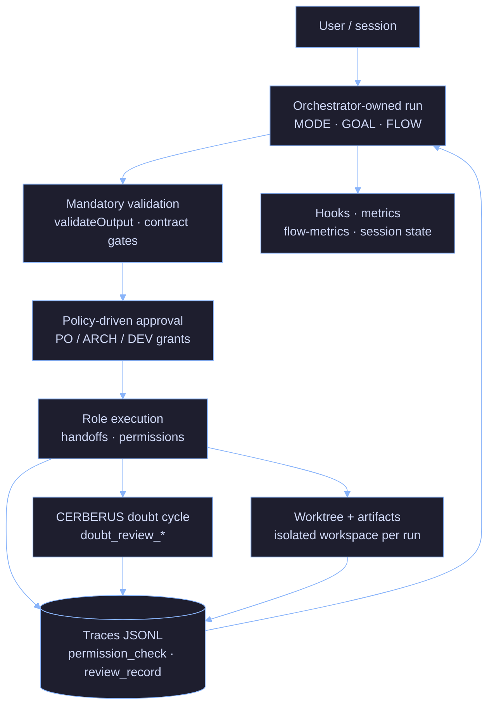

# AI Minions

[](./LICENSE) [](https://github.com/aetorresdev/ai-minions/releases) [](https://github.com/aetorresdev/ai-minions/issues) [](https://github.com/aetorresdev/ai-minions/pulls) [](https://github.com/aetorresdev/ai-minions/commits/master) [](https://github.com/aetorresdev/ai-minions/actions/workflows/orchestrator-unit-tests.yml) [](https://github.com/aetorresdev/ai-minions/actions/workflows/orchestrator-e2e.yml)

Most AI coding tools can write code. They do not enforce roles, gates, approvals, or traceable workflow boundaries.

**ai-minions** is a **control-first AI workflow harness** for engineers who want AI-assisted work to be **reviewable before it becomes risky**.

**Your CI/CD governs what ships.** ai-minions governs **how AI helps build it** (contracts, traces, permission gates, CERBERUS review, budget stops—not another editor competing with your pipeline tools).

Technical framing: **contract-driven agent harness** — see [`docs/orchestrator/harness-engineering-positioning.md`](docs/orchestrator/harness-engineering-positioning.md). Do not describe the project primarily as a “multi-agent framework” or “autonomous agent platform.”

**Execution modes** (control-first, not swarm-first):

1. **Single-agent / multi-role** — one session, multiple contractual roles sequentially; default for local runs, cost, and debugging.
2. **Supervised multi-agent** — bounded agents under an orchestrator-owned run; the orchestrator keeps budget, permissions, trace, approvals, and outcome.

Supports **single-agent multi-role** workflows and **supervised multi-agent** execution. Multi-agent is an **execution strategy**, not the product category. **ai-minions is control-first, not single-agent-only.** Not a swarm platform, LangGraph alternative, or “advanced multi-agent framework” claim.

**Validation is mandatory. Human approval is configurable.** Risk determines whether human approval is required—a well-defined epic may skip manual PO approval when policy allows, but never skip contractual validation. See [`harness-engineering-positioning.md`](docs/orchestrator/harness-engineering-positioning.md) § Validation vs human approval.

It focuses on:

- Explicit role contracts
- Compact handoffs
- Validation gates
- Traceable decisions
- Permission-aware execution
- Observable run outcomes

The goal is not to make agents sound autonomous. The goal is to make agent behavior **bounded, auditable, and rejectable** before it damages the workflow.

> ai-minions is not trying to make agents more human. It is building the harness around them so their work becomes bounded, observable, testable, and rejectable.
> *Si no lo entiendo, no lo apruebo.* — If I don't understand it, I don't approve it.
> Most production incidents start with someone doing exactly the opposite.

---

## What is ai-minions?

- A **human-supervised**, **contract-driven** harness for AI-assisted software work: fixed MODE roles, structured handoffs, and validation gates—not an autonomous team that owns releases.
- **Control-first, not single-agent-only:** multi-agent is an execution mode under governance, not the product category ([`harness-engineering-positioning.md`](docs/orchestrator/harness-engineering-positioning.md) § Execution modes).
- **Manager-owned orchestration:** the orchestrator plans and gates work; **handoffs** are for explicit ownership transfer, not every role switch. See [`docs/orchestrator/agent-contract.md`](docs/orchestrator/agent-contract.md) (MODE + YAML).
- **Evidence over chat memory:** traces, `validateOutput`, and optional MCP-backed gates—not “vibes” as the audit trail. Orchestrator product path: [`orchestrator/README.md`](orchestrator/README.md).

---

## Problems it solves

The default agent stack is structurally unsafe for anything that actually matters in production—and that is exactly where people are starting to use it:

| Failure mode | Why it burns you |
|---|---|
| **Prompt engineering at scale** | Instructions drift; nobody can replay *why* a decision counted. |
| **Naive multi-agent** | Cost explodes; you still have no gate on "did this transition actually happen?" |
| **Unvalidated outputs** | Confident prose with no artifact list, no test output, no blocked advance. |
| **No role separation** | One chat mixes author, reviewer, and release narrative. Accountability collapses. |

---

## Without ai-minions vs with ai-minions

| Without | With |
|---------|------|
| Roles and accountability blur in one thread | One MODE per response; contracts in [`agent-contract.md`](docs/orchestrator/agent-contract.md) |
| Tool/network access easy to mis-scope | Permission classification + gates + `permission_check` traces ([`runtime-permission-contract.md`](docs/orchestrator/runtime-permission-contract.md)) |
| Cost and failures as folklore | Token summaries, budget hard-stop, JSONL traces ([`strict-mode.md`](docs/orchestrator/strict-mode.md), [`orchestrator/README.md`](orchestrator/README.md)) |

---

## Philosophy

AI systems should be treated as engineering systems, not collaborators.

- Outputs are not trusted — they are validated
- Roles are not blended — they are isolated
- Progress is not assumed — it is gated
- Cost is not ignored — it is measured

---

## How it works

Three control layers:

**1. Roles and contracts** — Fixed MODEs (`ORCHESTRATOR`, `OWNER`, `ARCHITECT`, `DEV`, `QA`, `CERBERUS`) with explicit FORBID rules and structured YAML handoffs. One role per response; no self-review. Full contract: [`docs/orchestrator/agent-contract.md`](docs/orchestrator/agent-contract.md).

**2. Validation** — Every agent step is checked by `validateOutput()` against a role contract. Failures are explicit (`gate_id`). No silent pass. When MCPs are enabled, `orchestrator-state` enforces transitions on disk—the transcript does not override the log.

**3. Observability** — Hooks write token/cost/MODE summaries per session and per phase. Traces record contract failures, gate results, and blocker counts. Same `GOAL`, different `FLOW` → diff the files.

Full wiring: [`docs/orchestrator/system-architecture-diagram.md`](docs/orchestrator/system-architecture-diagram.md).

---

## What makes this different

- Contracts are **enforced**, not suggested
- Transitions are **gated**, not assumed
- Failures are **recorded**, not hidden
- Comparisons are based on **traces**, not impressions
- Degraded mode is **loud**, not silent

---

## Quickstart

### Runtime reality (read first)

| Layer | What runs | Required for smoke? |
|-------|-----------|---------------------|
| **Node runner** | `orchestrator/` — planning loop, gates, traces (`node run-orchestrator.js`) | **Yes** — `npm ci` + `npm test` |
| **Worker agents** | **`claude` CLI** — DEV/QA/CERBERUS/etc. spawn fresh CLI calls ([`orchestrator/README.md`](orchestrator/README.md) § Runtime dependency on the claude CLI) | **Yes** for real orchestrator runs; **not** for unit tests alone |
| **Local planner** | **Ollama** — orchestrator + handoff summarizer (optional locally; E2E may require it) | No for `npm test` |

**This is not:**

- A **packaged global installer** (no brew/npm `-g` product — clone + bootstrap only).
- A **production TUI product** — `npm run runner:tui` is a **CLI MVP** for tests/operators, not an external-ready app (v0.12 polish).
- **Provider-agnostic execution** — workers are Claude CLI-backed today; bring-your-own runner is documented, not shipped as alternate backend.

Detail: [`orchestrator/README.md`](orchestrator/README.md) · full smoke walkthrough: [`docs/how-to/usage-smoke-guide.md`](docs/how-to/usage-smoke-guide.md).

### New clone (external testers)

Use any directory — **do not** assume `~/.claude` unless you want the maintainer layout.

```bash
git clone https://github.com/aetorresdev/ai-minions.git REPO_ROOT
cd REPO_ROOT/orchestrator
npm ci
npm test
```

Expect unit tests to pass (see CI badge). That validates the Node harness only — **not** a full agent run (needs `claude` CLI + optional Ollama for live orchestration).

**Optional maintainer layout** (hooks/skills paths some docs reference):

```bash
git clone https://github.com/aetorresdev/ai-minions.git ~/.claude
```

### Prerequisites

| Check | Notes |
|-------|--------|
| **Node.js ≥ 18** | `node --version` |
| **Claude Code + `claude` CLI** | Worker agents; `claude --version` / `claude auth status` before live runs |
| **Cursor or Warp** (typical) | Paste MODE headers in chat; hooks optional |
| **Ollama** (optional) | Planner/summarizer + strict E2E — [`local-model-discovery.md`](docs/orchestrator/local-model-discovery.md) |
| **MCP servers** (optional) | Without them, runner uses **degraded mode** (visible banner) — [`strict-mode.md`](docs/orchestrator/strict-mode.md) |

MCP install reference: [`docs/mcp-installation.md`](docs/mcp-installation.md).

### Try orchestration (Claude Code)

Paste at the **start** of a chat:

```text
MODE: ORCHESTRATOR
FLOW: single_agent
GOAL: <your goal here>
MAX_ITERATIONS: 3
```

Add `FLOW: multi_agent` + `CWD: /absolute/path/to/project` for the hook-driven background runner. Optional `ENVIRONMENT` block — **credential names only**, never values: [`environment-access.md`](docs/orchestrator/environment-access.md).

**Simple skill** (no header): e.g. `Review this Dockerfile`.

**Operator CLI** (discover flags — not a polished product UI):

```bash
cd REPO_ROOT/orchestrator
node run-orchestrator.js --help
npm run runner:tui -- --help    # CLI MVP panels — not external product TUI
```

Slash-style aliases (doc only): [`docs/how-to/operator-slash-commands.md`](docs/how-to/operator-slash-commands.md).

### Known limitations (alpha)

- **Alpha ≠ production** — no SLA, no multi-tenant isolation; see [Maturity](#maturity-implemented--planned--not-claimed) below.
- **`npm test` ≠ full agent smoke** — unit suite does not prove Claude CLI orchestration end-to-end.
- **`FLOW: multi_agent`** — still incomplete for some comparisons; metrics are directional only.
- **Degraded mode** — missing MCPs or `--skip-gates` = less protection; banner must be visible.
- **No global installer / doctor CLI** in this release — bootstrap is manual clone + `npm ci` (preflight/doctor documented separately).

More: [`orchestrator/README.md`](orchestrator/README.md) § Known limitations · [`usage-smoke-guide.md`](docs/how-to/usage-smoke-guide.md).

---

## Experiments and metrics

Three evidence classes. Same `GOAL`, different `FLOW` → diff the files, not the chat.

| Signal class | What it measures | Where it lives |
|---|---|---|
| **Cost** | Tokens and USD per session, per phase, per MODE | `flow-metrics.jsonl` (hook on `Stop`) |
| **Control failures** | `contract_fail`, `gate_result: false`, `degraded_mode` | `traces/<task_id>.jsonl` |
| **Runtime defects** | QA/CERBERUS findings, blocker counts, `validation_run` output | Handoffs + `cerberus_check` trace events |

**Interpretation rule:** if you cannot explain the delta between two runs using these three signals, the comparison is invalid.

### Status — SA vs MA

| `FLOW` | State |
|---|---|
| `single_agent` | Primary usage — multiple runs. |
| `multi_agent` | Supported as a **supervised** execution strategy, but still **alpha/incomplete** for broad comparisons. SA vs MA metrics remain **directional only**. |

---

## Core principles (Anthropic AI Fluency 4D)

The four competency names come from Anthropic's **AI Fluency** framework (© 2025 Rick Dakan, Joseph Feller, and Anthropic — CC BY-NC-SA 4.0). Canonical definitions: [anthropic.com/ai-fluency](https://anthropic.skilljar.com/ai-fluency-framework-foundations). The table below is only how they map to **this repo**:

| Principle | In this repo |
|---|---|
| **Delegation** | MODE routing — one role per response, no hat-swapping. |
| **Description** | YAML handoffs + per-role output minimums. |
| **Discernment** | QA and CERBERUS lanes; `validateOutput` hard fails. |
| **Diligence** | Append-only event log; degraded mode is explicit, never silent. |

---

## What this is NOT

- Not autonomous AI engineering — humans own scope, risk, and approval.
- Not a replacement for engineers — a structure for how agents are run and reviewed.
- Not prompt-engineering magic — wrong contracts fail in the open, not silently.
- Not a benchmark — SA vs MA metrics are directional only; no fabricated leaderboard tables here.
- Not a general **self-hosted AI workspace** or chat-first productivity app — control harness for reviewable agent work only.

---

## Security posture (honest)

**Full narrative (threats, gaps, layers):**
[`security-posture.md`](docs/orchestrator/security-posture.md).

**Treat ai-minions as an admin console** — tools, shell, MCP, local models, and
filesystem access are **privileged**. Do **not** expose the stack to the public
internet without your own auth, network controls, and secret handling.

- **Production Boundary Guard:** default mode **`agent_as_contributor`** — agents prepare
  branches/PRs/evidence; merge/tag/release stay human-controlled unless explicitly
  exceptional policy. Model and trace contract:
  [`production-boundary-guard.md`](docs/orchestrator/production-boundary-guard.md).
- **Shipped controls (see code + contracts):** capability matrix pre-check, MCP /
  shell / network / classified-invocation gates, trace schema, secret-shaped
  redaction — [`runtime-permission-contract.md`](docs/orchestrator/runtime-permission-contract.md),
  [`trace-privacy-contract.md`](docs/orchestrator/trace-privacy-contract.md),
  [`strict-mode.md`](docs/orchestrator/strict-mode.md).
- **Not a sandbox product:** widening `.ai-minions/permissions.yaml`, skipping gates,
  or ignoring degraded-mode banners can still cause real damage. The harness
  **reduces** risk; it does not **eliminate** operator responsibility.
- **Not secure-by-default** for casual public deployment — see admin-console section
  in the security doc.
- **Contracts stay authoritative** for exact behavior; the link above is the
  readable map.

---

## Maturity: implemented / planned / not claimed

| Bucket | What it means here |
|--------|---------------------|
| **Implemented** | MODE protocol + YAML handoffs, `validateOutput`, JSONL traces, permission evaluator + runtime gates, token/cost reporting and run budget hard-stop, hook metrics, worktree isolation (v0.3), CERBERUS doubt cycle + `review_record`, design contracts for BV gate and progressive disclosure (validators/tests). |
| **Partial** | Skill registry allowlist (`skill-registry.v1.json`); untrusted-context fixture harness; handoff/sandbox **design** docs |
| **Planned** | Durable session/resume semantics; skill router runtime; sandbox/credential broker runtime; progressive-disclosure **enforcement** in runner — see [`docs/orchestrator/README.md`](docs/orchestrator/README.md), not implied as shipped. |
| **Not claimed** | Production SLA, OSI “open source” license, hosted control plane, turnkey marketplace, multi-tenant isolation, general AI workspace, fully sandboxed autonomous execution — see [`LICENSE`](LICENSE) and [`COMMERCIAL_LICENSE.md`](COMMERCIAL_LICENSE.md). |

---

## Roadmap (high level)

1. Keep **contracts, gates, and traces** aligned with code under `orchestrator/` and `docs/orchestrator/`.
2. **Alpha readiness:** run and release checklists — [`pre-run-checklist.md`](docs/orchestrator/pre-run-checklist.md), [`alpha-release-checklist.md`](docs/orchestrator/alpha-release-checklist.md).
3. **Harness positioning (detail):** [`docs/orchestrator/harness-engineering-positioning.md`](docs/orchestrator/harness-engineering-positioning.md) — README stays the map, not the full design. Layer stack: [`docs/orchestrator/agent-harness.md`](docs/orchestrator/agent-harness.md).

Full doc index: [`docs/orchestrator/README.md`](docs/orchestrator/README.md).

---

## Architecture



Full wiring diagram: [`docs/orchestrator/system-architecture-diagram.md`](docs/orchestrator/system-architecture-diagram.md).

---

## Repository map

| | |
|---|---|
| [`docs/orchestrator/security-posture.md`](docs/orchestrator/security-posture.md) | Public security posture + threat model (honest); links contracts and tests |
| [`docs/orchestrator/agent-contract.md`](docs/orchestrator/agent-contract.md) | Roles, handoff YAML, state-store authority, output contracts |
| [`docs/orchestrator/harness-engineering-positioning.md`](docs/orchestrator/harness-engineering-positioning.md) | Harness engineering framing; manager-owned orchestration; implemented vs not claimed |
| [`docs/orchestrator/local-inference-sizing.md`](docs/orchestrator/local-inference-sizing.md) | Local inference RAM/VRAM sizing (guidance only — not benchmarks) |
| [`docs/orchestrator/agent-harness.md`](docs/orchestrator/agent-harness.md) | Harness layers (context, memory/state, control, validation, observability) |
| [`docs/optional-contract-mode.md`](docs/optional-contract-mode.md) | Optional `minions.md` contract mode: goals, non-goals, behavior matrix (phase 1 design) |
| [`orchestrator/`](orchestrator/) | Node product runner: planning, `validateOutput`, MCP gates, traces |
| [`mcp-servers/orchestrator-state/`](mcp-servers/orchestrator-state/) | Disk-backed task store + gate MCP (pytest included) |
| [`mcp-servers/compact-handoff/`](mcp-servers/compact-handoff/) | Handoff compaction + alignment helpers (local Ollama) |
| [`scripts/hooks/`](scripts/hooks/) | Lifecycle hooks: MODE enforcement, context efficiency, handoff + QA skill enforcement, token/cost tracking, session state. Shared: `constants.py`, `gate_logger.py` |
| [`skills/`](skills/) | Task-scoped playbooks: Terraform, Docker, CI, n8n, observability, specs |
| [`agents/`](agents/) | Specialized subagent definitions consumed by skills |

Hook wiring: copy `settings.json.example` → `settings.json` and adapt paths. Do not commit secrets.

---

## License

AI Minions is **source-available** software.

You may use this repository for personal use, learning, research, evaluation, and community contribution under the terms of the [LICENSE](LICENSE). See also [NOTICE](NOTICE).

A **separate commercial license** is required for:

- internal business use
- production deployment for business purposes
- consulting or client delivery
- hosted / managed service use
- embedding AI Minions into a commercial product or service

Details: [COMMERCIAL_LICENSE.md](COMMERCIAL_LICENSE.md). Branding rules: [TRADEMARKS.md](TRADEMARKS.md).

This project is **not** licensed under an OSI-approved open source license.

For commercial licensing inquiries: **andres.torresduran@gmail.com**

[CONTRIBUTING.md](CONTRIBUTING.md)

---

*Legible before approval — not prettier prompts.*
