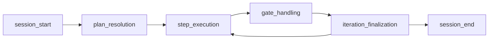

# Architecture coherence audit

**Location:** `docs/orchestrator/architecture-coherence-audit.md`. See [PATHS.md](PATHS.md).

**Status:** v0.8 A8-1 audit — **docs only**. No file moves, no runtime behavior change. **Not** a claim of architecture completeness.

**Related:** [root-file-inventory.md](root-file-inventory.md) · [module-ownership-map.md](module-ownership-map.md) · [module-boundaries.md](module-boundaries.md)

**Baseline:** v0.7.0-alpha.1 @ `8215c6f` · CI: `lint:module-boundaries` + allowlist · Physical modules: `modules/gates/` only.

---

## Purpose

Before v0.8 physical cleanup (A8-2), answer:

1. Does the **documented** system hang together across lifecycle, roles, contracts, gates, traces, skills, tools, and recovery?
2. Where are claims **ahead of** implementation?
3. What is the **ordered movement plan** for root sprawl reduction?

**Allowed matrix states (only these five):** `implemented` · `partial` · `design-only` · `planned` · `not claimed`

---

## System lifecycle (orchestrator run)

High-level phases implemented in `run-phases/` and coordinated by `orchestrator.js`:

| Stage | Primary owner | State | Evidence |
|-------|---------------|-------|----------|
| Session start / workdir bind | run-control + worktree | **implemented** | `run-phases/session-start.js`, worktree contracts |
| Plan resolution | run-control | **implemented** | `run-phases/plan-resolution.js`, capability matrix |
| Step execution | run-control + model-runtime | **implemented** | `run-phases/step-execution.js`, `agents/runtime/*` |
| Gate handling | gates + permissions | **partial** | Policy gates ship; human grant/deny UI paths incomplete per governance contract |
| Iteration finalization | run-control + trace | **implemented** | `iteration_done`, failure semantics contract |
| Session end / cleanup | run-control + worktree | **implemented** | `session-end.js`, worktree cleanup safety |
| Recovery / resume | recovery | **partial** | Detect + explain ship (`recovery-sweep`, `session-resume`); automatic resume **not claimed** |
| Operator inspect | operator | **implemented** | `explain-run`, `control-plane-tui`, runner TUI |

---

## Coherence matrix

Rows = capability areas. Columns use the five allowed states only (one primary state per row).

| Area | State | Coherent with | Gaps / drift |
|------|-------|---------------|--------------|
| **Lifecycle** | **implemented** | Trace events, run-phases tests, worktree binding | God-module `orchestrator.js` concentrates coordination |
| **Roles (MODE)** | **partial** | `agent-contract.md`, validateOutput hooks, handoff MCP | Not all roles have symmetric gate + contract coverage (e.g. BV reviewer) |
| **Contracts** | **partial** | Many `*Contract.test.js`, `lint:docs-claims` | Design validators still at root; handoff/sandbox design-only |
| **Gates** | **partial** | `modules/gates/`, approval/doubt/review trace shapes | Human approval UI/resume path incomplete; root gate files outside `modules/` |
| **Traces** | **implemented** | Schema v2, writer/redact, graph validation, privacy contract | `run-outcome-summary` imports `review-record` (hard-rule violation) |
| **Skills** | **partial** | `skill-registry.v1.json`, hook enforcement opt-in | Skill router runtime **planned**; progressive disclosure filter **planned** |
| **Tools** | **partial** | `tool-eval`, untrusted-context eval, MCP client | `security/` not under `modules/tools/`; MCP bleeds to operator paths |
| **Recovery** | **partial** | Recovery sweep + session resume contracts, tests | Imports gate modules from recovery files (CI hard allowlist); no `modules/recovery/` |
| **Permissions** | **implemented** | Capability matrix, permission gates, credential broker | Policy + trace coupling in permission gate shells |
| **Budget** | **implemented** | Token summaries, cost dimensions, runner budget view | No production spend SLA (**not claimed**) |
| **Worktree** | **implemented** | Isolation, promotion, lifecycle trace | — |
| **Operator surfaces** | **implemented** | CLI/TUI/export/preflight | Many root files; no physical `modules/operator/` |
| **Modular monolith layout** | **partial** | Design map + CI guard + `modules/gates/` | 55 root `.js` domain files; recovery ownership ambiguous in design map |
| **OTLP export** | **planned** | OTel mapper derived | OTLP sink **not claimed** for v0.8 |
| **Memory store** | **design-only** | `memory-store-decision.md` | No runtime memory SoT |
| **Swarm / multi-agent scale-out** | **not claimed** | — | Explicitly out of v0.8 lane |

---

## Roles ↔ contracts ↔ gates (cross-check)

| Role | Contract doc | Gate / trace | State |
|------|--------------|--------------|-------|
| ORCHESTRATOR | agent-contract | MODE transitions | **implemented** |
| DEV | agent-contract, approval-policy | DEV pre-check, validation | **implemented** |
| QA | review-record, handoff | `review_record` emit | **partial** — durable record ships; loop automation varies |
| CERBERUS | doubt-cycle, review-record | `doubt_review_*`, block/request_changes | **implemented** |
| ARCHITECT | approval-policy | policy-driven approval | **partial** |
| OWNER | agent-contract | human approval gates | **partial** — policy exists; UI path incomplete |
| BV reviewer | bv-reviewer-contract | `value_review` shape | **design-only** |
| RUN-ANALYST | — | — | **planned** (post-v0.8) |

---

## Import-boundary weak areas (CI truth)

From `module-boundary-allowlist.json`:

| Class | Count | Examples |
|-------|------:|----------|
| Matrix grandfathered | 33 | `orchestrator.js` ← runtime agents; `mcp-client` → `governance-gate` |
| Hard-rule grandfathered | 5 | `recovery-sweep` / `session-resume` → gates; `run-outcome-summary` → `review-record` |

**Coherence issue:** trace and recovery files importing gate modules blurs **read aggregation** vs **policy**. A8-2 should introduce narrow reader ports or move files into owning contexts per [module-ownership-map.md](module-ownership-map.md).

---

## Design-only vs implemented (honest claims)

| Doc / capability | Doc state | Runtime state | Risk if overstated |
|------------------|-----------|---------------|-------------------|
| handoff-contract | design-only | compact handoff MCP ships partial envelope | Operators assume ownership transfer |
| sandbox-credential-isolation-design | design-only | credential broker partial | Assumes full sandbox isolation |
| progressive-disclosure-contract | design-only | skill registry metadata only | Assumes runtime filter |
| self-improvement-loop-contract | design-only | design validator only | Assumes auto-apply |
| bv-reviewer-contract | design-only | no gate | Assumes value gate blocks merge |
| memory-store-decision | design-only | trace SoT only | Assumes mem0/local store authority |
| modular monolith complete | **not claimed** | partial (`gates/` only) | CERBERUS/doc drift |

---

## Recommended A8-2 movement plan

**Constraints:** Zero behavior change · shims for all moved public `require` paths · one PR slice per bounded context when possible · update allowlist keys as imports heal.

### Slice order (dependency-safe)

| Order | Slice | Files / dirs | Target module | Shim | Notes |
|------:|-------|--------------|---------------|------|-------|
| 1 | Contracts validators | `*-design.js` (3 files) | `modules/contracts/` | Yes | Low fan-in; no runtime |
| 2 | Recovery | `recovery-sweep.js`, `session-resume.js` | `modules/recovery/` | Yes | New context; fixes ownership ambiguity |
| 3 | Gates (remainder) | `approval-policy-gate.js`, `doubt-review.js`, `review-record.js` | `modules/gates/` | Yes | Join A2.1 tree; shrink root |
| 4 | Trace core | `trace-*.js`, `run-outcome-summary.js`, `context-hygiene-signals.js`, `otel-genai-trace-map.js` | `modules/trace/` | Yes | Refactor `run-outcome-summary` import of `review-record` |
| 5 | Budget | `token-*.js`, `cost-accounting-dimensions.js` | `modules/budget/` | Yes | Leave `runner-budget-view` in operator slice |
| 6 | Worktree | `worktree-*.js`, `run-workdir-contract.js`, `trace-workspace-lifecycle.js` | `modules/worktree/` | Yes | |
| 7 | Operator | `explain-run.js`, `runner-*.js`, `control-plane-tui.js`, etc. | `modules/operator/` | Yes | Largest file count; mostly independent |
| 8 | Model-runtime (root locals) | `local-model-*.js`, `runner-model-routing.js`, `flow-hook-bridge.js` | `modules/model-runtime/` | Yes | `agents/` subtree later |
| 9 | Permissions (root) | `credential-broker.js`, `environment-parser.js` | `modules/permissions/` | Yes | `agents/permissions.js` later |
| 10 | Tools | `mcp-client.js` + `security/tool-eval.js`, `skill-registry.js`, `untrusted-context-eval.js` | `modules/tools/` | Yes | Permission gate shells may stay until permissions slice |
| 11 | Run-control | `run-phases/`, `run-loop-helpers.js`, `run-state.js`, `qa-spec-flow.js`, `context-utils.js` | `modules/run-control/` | Yes | |
| 12 | Shared / legacy | `repo-root.js`, `minions-config.js`, `decision-engine.js`, `agents.js` | `modules/shared/` | Yes | Optional; can defer |
| 13 | Hub last | `orchestrator.js` | `modules/run-control/orchestrator.js` | Yes | Highest fan-in; verify export parity tests |

**Do not move in A8-2 min bar:** `cli.js`, `run-orchestrator.js`, `governance-gate.js`, `merge-governance/`, config, `schemas/`, `scripts/`, `tests/`.

### Post-move (A8-3)

- Extend `check-module-boundaries.js` / root import guard: **fail on new** root-level `*.js` except allowlisted entrypoints/shims.
- Shrink `module-boundary-allowlist.json` as violations are fixed.
- Add `modules/<context>/README.md` stubs per gates precedent.

### Explicitly deferred (post-v0.8)

- `agents/` tree physical split
- `security/` permission gate consolidation
- OTLP sink, memory runtime, BV gate, skill router runtime
- ESLint `import/no-restricted-paths` zones (optional)

---

## Audit verdict (A8-1)

| Criterion | Met |
|-----------|:---:|
| Every relevant root `.js` classified | ✓ — see [root-file-inventory.md](root-file-inventory.md) |
| Every runtime/domain file has one proposed context | ✓ |
| Every module has declared ownership | ✓ — see [module-ownership-map.md](module-ownership-map.md) |
| Matrix uses only five allowed states | ✓ |
| No file movement in this ticket | ✓ |
| A8-2 movement plan produced | ✓ — slice table above |

**System coherence summary:** The orchestrator **implements** a credible multi-role run lifecycle with trace SoT, permission gates, and partial modular enforcement. Coherence **frays** at physical layout (root sprawl), recovery↔gates imports, and design-only docs that must not be read as shipped runtime. v0.8 should improve **structure and release discipline**, not add features.

---

## Revision

| Date | Change |
|------|--------|
| 2026-05-18 | Initial A8-1 coherence audit + A8-2 movement plan |

Update after A8-2 slices land or matrix states change.
