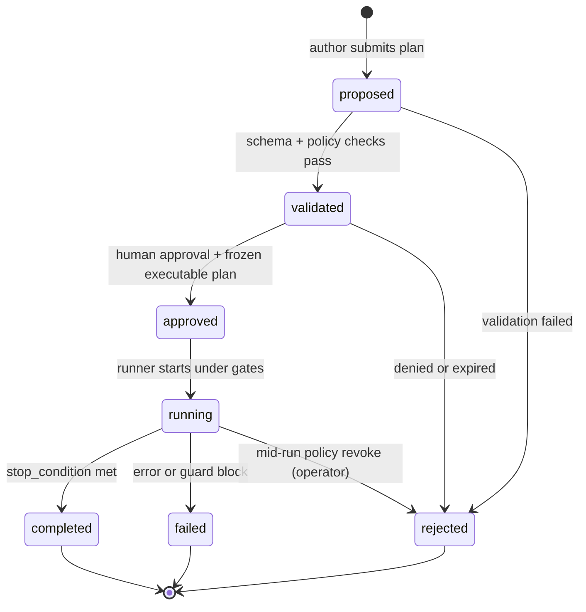

# Dynamic workflow contract

A **dynamic workflow** is a **proposed orchestration plan** (steps, fan-out/fan-in, loops, verification passes) that an agent or operator may submit **before** any extra runtime executes it. The plan is **not authority**: it must pass validation, policy, budget, isolation, governance, and human preview/approval gates.

**Status:** **Design-first** (post `v0.3.0-alpha.1`). **No runtime executor** ships with this document. External “dynamic workflow” products are **cross-check inputs only** — no compatibility or equivalence claims.

**Related:** [capability-flow-contract.md](capability-flow-contract.md) · [worktree-isolation-contract.md](worktree-isolation-contract.md) · [governance-gates-contract.md](governance-gates-contract.md) · [session-resume-contract.md](session-resume-contract.md) · [runner-tui-contract.md](runner-tui-contract.md) · [harness-engineering-positioning.md](harness-engineering-positioning.md)

---

## Core rules

| Rule | Meaning |
|------|---------|
| **Proposal ≠ execution** | `dynamic_workflow` in state `proposed` or `validated` must not spawn subagents, mutate repos, or bypass permission evaluation. |
| **Approved plan only** | Transition to `running` requires `approved` plus an **executable plan** snapshot (immutable hash) distinct from the draft proposal. |
| **Fail closed** | Missing budget envelope, isolation policy, permission scope, approval policy, or stop condition → validation error → `rejected` (no partial run). |
| **No safe-by-branding** | Passing schema validation does **not** imply sandbox, credential broker, or production safety. |
| **Trace or it did not happen** | Every workflow step and subagent leg must be attributable in JSONL (`trace_refs`). |

---

## Vocabulary

| Term | Meaning |
|------|---------|
| **Workflow proposal** | Human- or agent-authored `dynamic_workflow` document still subject to edit/revision. |
| **Executable plan** | Frozen copy taken at `approved` (content hash recorded); only this object may drive `running`. |
| **Workflow step** | One unit in the plan: role, intent, inputs/outputs, optional fan-out group id. |
| **Subagent leg** | A child run spawned under a step; must carry parent `workflow_id` + `step_id` in trace. |
| **Preview** | Operator-readable summary (roles, tools, models, cost ceiling, isolation, stop rules) **before** approval. |

---

## Lifecycle states

| State | Who may advance | Runtime allowed |
|-------|-----------------|-----------------|
| `proposed` | Author / validator | **No** |
| `validated` | Operator approval UI or explicit grant | **No** |
| `approved` | Runner (after re-check) | **Prepare only** (preflight) |
| `running` | Runner under gates | **Yes**, within limits |
| `completed` / `failed` / `rejected` | Terminal | **No** new legs |

---

## On-disk envelope (`dynamic_workflow`)

Suggested path (implementation TBD): `.claude/dynamic-workflow.json` beside task/run metadata, or trace-embedded checkpoint. **Schema version:** `"1"`.

### Top-level fields

| Field | Required | Purpose |
|-------|----------|---------|
| `schema_version` | yes | `"1"` |
| `workflow_id` | yes | Stable id (UUID or `task_id` suffix) |
| `state` | yes | `proposed` · `validated` · `approved` · `running` · `completed` · `failed` · `rejected` |
| `proposal` | yes while not terminal | Authoring object (see below) |
| `executable_plan` | yes when `approved`+ | Frozen plan + `content_hash` |
| `limits` | yes | Hard ceilings (see **Mandatory limits**) |
| `worktree_policy` | yes | How isolated trees apply per leg |
| `approval_policy` | yes | Human gate requirements |
| `stop_condition` | yes | Termination semantics |
| `trace_refs` | yes when running+ | Audit pointers |
| `preview` | yes before `approved` | Operator-facing summary |
| `validation` | optional | Last validator output (`errors[]`, `warnings[]`) |
| `created_at` / `updated_at` | yes | ISO-8601 |

### `proposal` object (editable)

| Field | Purpose |
|-------|---------|
| `title` | Short operator label |
| `goal` | Outcome statement (non-authoritative) |
| `steps[]` | Ordered steps (see **Step shape**) |
| `fan_out_groups[]` | Optional parallel groups with merge step id |
| `author` | `role_id` or `operator` |
| `source` | `human` \| `agent` \| `import` (no product compat field) |

### `executable_plan` object (immutable at approval)

| Field | Purpose |
|-------|---------|
| `content_hash` | SHA-256 of canonical JSON (stable key order) |
| `approved_at` | ISO timestamp |
| `approved_by` | Operator id or role |
| `steps[]` | Copy of validated steps (no in-place edits after this) |
| `limits` | Copy of limits at approval time |

---

## Mandatory limits

All fields below are **required** on every workflow. Validators reject the document if any are absent or out of policy bounds.

| Field | Type | Semantics |
|-------|------|-----------|
| `max_subagents` | int ≥ 0 | Hard cap on spawned legs per workflow run |
| `max_iterations` | int ≥ 1 | Loop/backtrack ceiling |
| `max_tokens` | int ≥ 0 | Budget guard input (rollup across legs) |
| `max_runtime_ms` | int ≥ 0 | Wall-clock ceiling |
| `allowed_roles` | string[] | Subset of [capability-flow-contract.md](capability-flow-contract.md) roles |
| `allowed_models` | string[] | Explicit model ids or patterns allowed |
| `allowed_tools` | string[] | Tool/MCP action ids allowed (manifest-aligned) |
| `worktree_policy` | object | See **Worktree policy** |
| `approval_policy` | object | See **Approval policy** |
| `stop_condition` | object | See **Stop condition** |

### Worktree policy

| Field | Values | Notes |
|-------|--------|-------|
| `mode` | `none` \| `per_run` \| `per_step` \| `per_subagent` | Maps to [worktree-isolation-contract.md](worktree-isolation-contract.md) |
| `reuse_binding` | bool | Whether legs may reuse an existing `task_id` tree |
| `cleanup_policy` | `retain` \| `cleanup_on_success` \| `cleanup_always` | Default **`retain`** unless operator opts in |
| `run_workdir_contract_ref` | path or inline | Each leg must resolve [run workdir contract](worktree-isolation-contract.md#run-workdir-contract) before cwd bind |

**Gap (explicit):** [worktree result promotion](worktree-isolation-contract.md) is **not claimed** — outputs stay in worktree until a future promotion contract exists.

### Approval policy

| Field | Purpose |
|-------|---------|
| `requires_human_before_run` | Must be `true` for alpha dynamic workflows |
| `preview_required` | Operator must acknowledge `preview` |
| `governance_gate_ids` | Optional list aligning with [governance-gates-contract.md](governance-gates-contract.md) |
| `cerberus_review` | When true, CERBERUS role must emit `review_record` before `approved` |

**Default:** `requires_human_before_run: true`, `preview_required: true`. **No auto-run** without recorded approval events.

### Stop condition

| Field | Purpose |
|-------|---------|
| `type` | `all_steps_done` \| `first_success` \| `consensus` \| `budget_exhausted` \| `operator_abort` |
| `max_failures` | int — terminal `failed` when exceeded |
| `success_step_ids` | optional allow-list for `first_success` |

---

## Step shape

Each `steps[]` entry:

| Field | Required | Purpose |
|-------|----------|---------|
| `step_id` | yes | Stable within workflow |
| `role_id` | yes | Must ∈ `limits.allowed_roles` |
| `intent` | yes | Human-readable (not executable code) |
| `capabilities_ref` | yes | e.g. `cap.dev_backend.v1` |
| `tools` | optional | Must ⊆ `limits.allowed_tools` when present |
| `models` | optional | Must ⊆ `limits.allowed_models` when present |
| `inputs` / `outputs` | optional | Typed handoff refs (no raw secrets) |
| `fan_out_group_id` | optional | Links parallel legs |
| `verification` | optional | `adversarial` \| `peer_review` — spawns checker leg(s), still bounded by `max_subagents` |

**Rejected shapes:** executable JavaScript, shell blobs, `eval`, arbitrary subprocess commands, or steps without `role_id` + `capabilities_ref`.

---

## Preview (operator)

Before `approved`, the runner or CLI must render a **preview** block (markdown or TUI panel) containing at minimum:

- Workflow title, goal, state
- Step list with roles and tool/model sets
- `limits` summary (subagents, iterations, tokens, runtime)
- `worktree_policy.mode` + cleanup behavior
- `stop_condition` type and failure cap
- Estimated cost hint when `ORCH_MAX_COST_USD` / token budgets apply ([runner-tui-contract.md](runner-tui-contract.md) `budget`)
- Explicit **“Not claimed”** line: no sandbox, no credential broker, no external product parity

Preview content is **informational**; approval is a separate trace event.

---

## Validation (fail closed)

A validator (future `validateDynamicWorkflow`) must check:

1. Schema version and required top-level fields.
2. `limits` complete and within operator-configured ceilings.
3. Every `steps[].role_id` allowed; every tool/model ⊆ limits.
4. **Capability matrix:** each `capabilities_ref` resolves and matches role ([capability-flow-contract.md](capability-flow-contract.md) § plan validation rules).
5. `worktree_policy` consistent with requested `mode` (e.g. `per_subagent` requires `max_subagents` ≥ 1).
6. `approval_policy.requires_human_before_run === true` unless explicit experimental flag (off by default).
7. `stop_condition` present and recognizable.
8. No forbidden executable payloads in proposal.
9. `preview` generated and non-empty before transition to `approved`.

On failure: `state → rejected`, `validation.errors[]` populated, **no** transition to `running`.

---

## Trace references (`trace_refs`)

When `state` is `running` or terminal, `trace_refs` must allow audit of fan-out/fan-in:

| Ref type | Points to |
|----------|-----------|
| `workflow_checkpoint` | Trace line id where workflow state last persisted |
| `step_trace` | `{ step_id, run_id, jsonl_path, line_range? }` |
| `subagent_trace` | Child `task_id` + parent `step_id` |
| `approval_event` | `approval_required` / `approval_granted` / `review_record` ids |
| `budget_event` | `budget_warning` / `budget_block` lines |
| `workspace_event` | `workspace_*` lifecycle lines per [worktree-isolation-contract.md](worktree-isolation-contract.md) |

Parent traces must include `workflow_id` on spawned legs. Fan-in merge steps must reference all child `subagent_trace` refs.

---

## Integration map

| Concern | Existing contract | Dynamic workflow usage |
|---------|-------------------|------------------------|
| Filesystem isolation | [worktree-isolation-contract.md](worktree-isolation-contract.md) | `worktree_policy` selects per-leg trees; binds via run workdir contract |
| Permissions | [runtime-permission-contract.md](runtime-permission-contract.md) | Each leg runs normal evaluator; proposal does not bypass |
| Human approval | [governance-gates-contract.md](governance-gates-contract.md) | `approval_policy` + trace `approval_*` |
| Budget | Runner budget guard / `ORCH_MAX_COST_USD` | `limits.max_tokens` + cost events |
| Resume | [session-resume-contract.md](session-resume-contract.md) | Workflow checkpoint may reference session checkpoint; resume **revalidates** side effects |
| Capability plan | [capability-flow-contract.md](capability-flow-contract.md) | Steps must align with matrix before run |
| CERBERUS | [review-record-contract.md](review-record-contract.md) | Optional `cerberus_review` before approve |
| Result promotion | *(gap)* | Out of scope until promotion contract ships |

---

## Pattern cross-check (external dynamic workflows)

Triage only — **no** “Claude Code equivalent” claim. Status for harness planning:

| Pattern | ai-minions today | Gap / contract |
|---------|------------------|----------------|
| Classify-and-act | MODE + permission evaluator | Partial — plan steps need explicit `intent` typing in validator |
| Fan-out / fan-in | Multi-agent flow_mode (limited); worktree per leg | **Gap** — fan-in merge + `trace_refs` rules in this doc |
| Adversarial verification | CERBERUS / QA roles, `review_record` | Partial — encode as `verification` step shape |
| Generate-and-filter | Governance + permission deny | Partial — no generated-script execution |
| Tournament / consensus | Not implemented | **Gap** — `stop_condition.type: consensus` design only |
| Loop until converged | `max_iterations` in task envelope | Partial — workflow-level loop needs runner wiring |
| Budget-aware orchestration | Budget guard + TUI `budget` | **Implemented** — must reference `limits.max_tokens` |
| Resumable workflow state | [session-resume-contract.md](session-resume-contract.md) | Partial — workflow checkpoint vs session checkpoint |

Full benchmark triage (apéndice F) remains in **EVAL-BENCHMAP** deliverable; this table is the contract-side minimum.

---

## Not claimed

- Executing agent-generated JavaScript or shell as workflow bytecode
- Dynamic workflow **runtime** (scheduler, background jobs, marketplace)
- Hundreds of parallel subagents in production
- Auto-run without human approval
- Sandbox, Zero Trust, credential broker, or “secrets never in model”
- Compatibility with any external dynamic workflow product
- Auto-merge of parallel branches or worktree output promotion

---

## Promotion to runtime (future)

Runtime work stays **blocked** until:

1. This contract is CERBERUS-approved as doc-only deliverable.
2. `validateDynamicWorkflow` exists with tests (fail-closed cases).
3. Preview + approval trace events are wired in runner/TUI.
4. A separate ticket scopes **one** execution slice (e.g. validate-only CLI) — no bundled fan-out engine.

---

## Operator checklist (design phase)

- [ ] Author proposal with all **Mandatory limits** filled
- [ ] Run validator (when implemented) → `validated` or `rejected`
- [ ] Read **Preview**; confirm worktree and budget ceilings
- [ ] Record human approval + freeze `executable_plan`
- [ ] Only then allow runner `running` with existing gates active
