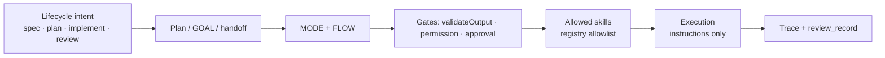

# Skill router — lifecycle intent design (no runtime)

**Location:** `docs/orchestrator/skill-router-design.md`. See [PATHS.md](PATHS.md) if your workspace root differs.

**Status:** **Design contract only** — intent → phase/role/skill policy documented here. **No** runtime router, slash import, or opaque skill picker in `orchestrator/`.

**Related:** [workflow-skill-contract.md](workflow-skill-contract.md) · [progressive-disclosure-contract.md](progressive-disclosure-contract.md) · [agent-contract.md](agent-contract.md) · [capability-flow-contract.md](capability-flow-contract.md) · [skill-security-threatmodel.md](skill-security-threatmodel.md).

**Prerequisite for runtime:** local skill registry + allowlist (see [workflow-skill-contract.md](workflow-skill-contract.md)) before automated skill disclosure.

---

## Problem

Operators and models need **bounded** help for lifecycle phases (spec, plan, implement, review) without:

- an opaque router that picks arbitrary third-party skills;
- slash commands copied from external packs (`/spec`, `/plan`, …);
- skill text becoming permission policy;
- marketplace discovery replacing harness gates.

The **orchestrator owns routing**; skills are **capabilities** invoked under MODE, permission, and disclosure policy.

---

## Design principles

| Principle | Meaning |
|-----------|---------|
| **Orchestrator-owned routing** | MODE + FLOW + plan steps decide phase; skills never advance roles or skip gates. |
| **Explicit intent, not free-form pick** | Lifecycle intent is declared in GOAL/plan/handoff — not inferred from chat tone. |
| **Registry before automation** | Skill allowlist is required before runtime skill injection or filtering. |
| **Instructions ≠ execution** | `SKILL.md` is untrusted text; shell/MCP/network still pass `evaluatePermission`. |
| **Trace or it did not happen** | Future runtime emits `context_disclosure` / skill-load events per [progressive-disclosure-contract.md](progressive-disclosure-contract.md). |

---

## Lifecycle intent → harness mapping

| Lifecycle intent | Primary MODE(s) | Typical skills (examples) | Gates that stay canonical |
|------------------|-----------------|---------------------------|---------------------------|
| **Spec / scope** | `OWNER`, `ARCHITECT` | `feature-spec-and-tasks`, `contracts-with-llm` | Handoff YAML; no DEV without policy |
| **Plan / design** | `ARCHITECT` | `designing-terraform`, `architecture-planner` | CERBERUS when policy requires |
| **Implement** | `DEV` | `creating-terraform`, `reviewing-docker`, domain skills | Permission evaluator; worktree isolation when enabled |
| **Review / doubt** | `QA`, `CERBERUS` | *(none by default — role contract)* | `review_record`, `doubt_review_*` |
| **Operator post-run** | Operator (no MODE) | `orchestrator-token-report`, `audit-patterns` | Read-only; no gate bypass |

**Rule:** Skills **assist** the active MODE; they do **not** replace MODE transitions or CERBERUS review.

---

## Routing inputs (future runtime)

When a runtime router is implemented, expected inputs:

| Input | Source | Notes |
|-------|--------|-------|
| `lifecycle_intent` | GOAL tag, plan step, or handoff field | Enum: `spec`, `plan`, `implement`, `review`, `operator` |
| `active_role` | Current MODE | From orchestrator state |
| `flow` | `single_agent` / `multi_agent` | Affects cost and parallelism policy |
| `skill_allowlist` | `skill-registry.v1.json` | Deny-by-default |
| `disclosure_policy` | Progressive disclosure contract | Index vs full `SKILL.md` body |
| `permission_context` | Session mode + capability matrix | Independent of skill text |

**Outputs (non-authoritative):** suggested skill ids for IDE discovery or context injection — never auto-execute tools.

---

## Anti-patterns (rejected)

| Anti-pattern | Why rejected |
|--------------|--------------|
| Opaque “skill router” LLM picks any skill from the internet | Expands blast radius; no audit trail |
| Importing external `/spec` `/plan` slash namespace | Not registered in harness; implies false compatibility |
| Skill frontmatter as permission YAML | Text is not policy; gates stay in code/contracts |
| Auto-load full skill bodies for every step | Token waste + injection surface |
| Skills that claim to auto-approve or bypass CERBERUS | Violates [agent-contract.md](agent-contract.md) |
| Marketplace catalog as source of truth | Out of scope; local `skills/` only |

---

## Relationship to other contracts

| Contract | Role |
|----------|------|
| [progressive-disclosure-contract.md](progressive-disclosure-contract.md) | **What** may appear in context per role/step |
| [skill-registry-contract.md](skill-registry-contract.md) | **Which** skills exist and are allowlisted (hook opt-in; router runtime pending) |
| This doc | **When** lifecycle intent maps to phases and eligible skills |

---

## Not claimed

- Automatic skill selection without registry allowlist
- Compatibility with external slash-command packs
- Skills replacing MODE protocol or permission evaluation
- Production-ready automated skill router

---

## Revision

Update when skill registry ships or runtime promotion is scoped.
