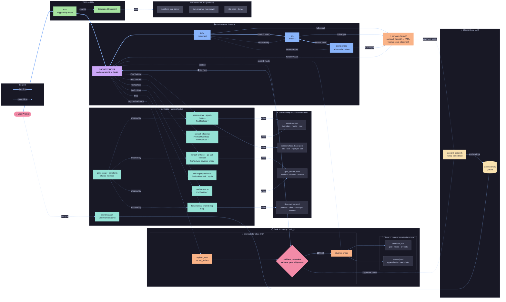

# System architecture — operational wiring (full diagram)

This document holds the **full** Mermaid diagram of how components connect in this repository: skills, hooks, MODE protocol, MCPs, disk-backed task state, Ollama/OpenMemory, and optional external MCPs.

The [root README](../../README.md) keeps a **compressed** view for positioning; use this file when you need the **internal workflow** (what talks to what, and when).

**Related:** [agent-contract.md](agent-contract.md) (protocol and authority rules) · [strict-mode.md](strict-mode.md) (gate sequence) · [PATHS.md](PATHS.md) (clone paths)

---

## Diagram (LR — data vs control flow)

**Legend:** solid arrows = primary data path; dotted arrows = control / lifecycle / optional checks.
