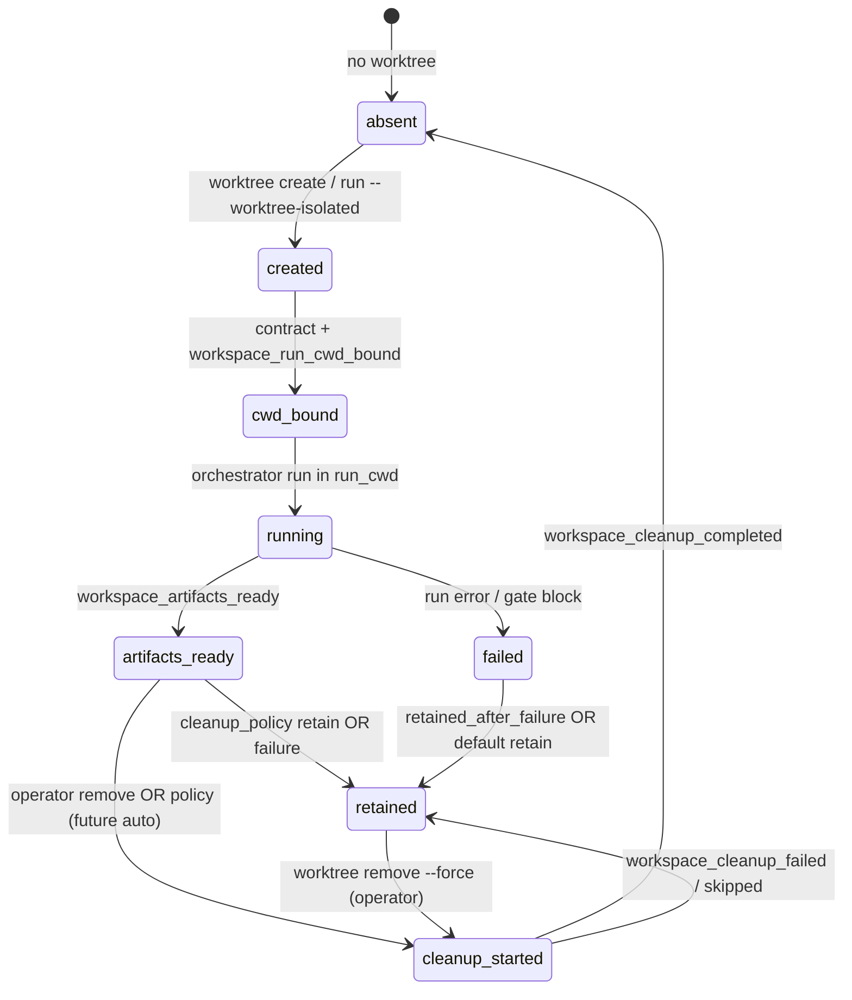

# Worktree isolation contract

Git worktree isolation gives each orchestrator run a **separate working tree** keyed by `task_id`. This is a **filesystem boundary** only — it does not replace permission profiles, secret handling, budget guards, governance gates, or CERBERUS review.

**Release:** `v0.3.0-alpha.1 — Workspace isolation alpha` (runtime slices merged + lifecycle/operator doc). Evidence: unit tests in `worktreeIsolation.test.js`, `runWorkdirContract.test.js`, `traceWorkspaceLifecycle.test.js`, `worktreeCleanupSafety.test.js`.

## End-to-end lifecycle

One run maps to at most one managed worktree under `ORCH_WORKTREES_DIR` (default `<repo>/.claude/worktrees/<task_id>`).



| Phase | Operator action | Trace | On-disk |
|-------|-----------------|-------|---------|
| Provision | `worktree create --run-id <id>` or `run --worktree-isolated` | `workspace_created` / `workspace_reused` / `workspace_rejected` | binding + `run-workdir-contract.json` |
| Bind | Runner resolves `run_cwd` from contract | `workspace_run_cwd_bound` | `trace_refs[]` updated |
| Execute | `run-orchestrator` / hooks in worktree cwd | normal agent/trace lines | mutations under worktree only |
| Outcome | Run completes or fails | `run_outcome_summary.workspace` rollup | `retained_after_failure` when applicable |
| Teardown | `worktree remove [--force]` | `workspace_cleanup_*` | git worktree removed (cleanup safety validates path) |

**Default today:** `run --worktree-isolated` does **not** auto-remove; `cleanup_policy` defaults to **`retain`** on create. Operator removes explicitly or leaves trees for inspection.

## Model

| Concept | Mapping |
|---------|---------|
| Primary repo | Operator checkout (`repo_root`) |
| Isolated run | Git worktree under `ORCH_WORKTREES_DIR` (default `<repo>/.claude/worktrees/<task_id>`) |
| Branch | `orch/<task_id>` (created from `HEAD` or `--base-ref`) |
| Binding | `<worktree>/.claude/worktree-binding.json` (transitional) |
| Run workdir contract | `<worktree>/.claude/run-workdir-contract.json` (canonical) |
| Trace | Optional `session_start` fields when `cwd` is a managed worktree |

## Binding file

Path: `.claude/worktree-binding.json`

| Field | Purpose |
|-------|---------|
| `schema_version` | `"1"` |
| `task_id` | Orchestrator task id / trace basename |
| `repo_root` | Primary git root |
| `primary_cwd` | Operator cwd used to create the worktree |
| `worktree_path` | Absolute path to isolated tree |
| `branch` | Dedicated branch name |
| `base_ref` | Ref used at creation |
| `traces_dir` | Snapshot of `ORCH_TRACES_DIR` at creation (informational) |

## Run workdir contract

Path: `.claude/run-workdir-contract.json`

Canonical record for **where a run executes** and how artifacts/cleanup are addressed. `readRunWorkdirContract` loads the contract file when present; otherwise synthesizes from the binding file (backward compatible). `validateRunWorkdirContract` requires top-level fields plus `run_cwd`, `execution_state`, and `business_artifacts` (including `mutable_paths` / `read_only_paths`) so malformed on-disk JSON fails closed instead of crashing the CLI.

| Field | Purpose |
|-------|---------|
| `schema_version` | `"1"` |
| `run_id` | Orchestrator task id |
| `repo_root` | Primary git root (**read-only** source of truth for the run) |
| `base_ref` | Ref at workspace creation |
| `worktree_path` | Isolated execution directory |
| `run_cwd` | Process cwd for the run (equals `worktree_path` when isolated) |
| `artifact_root` | Per-run mutable artifact directory (default `<worktree>/.claude/run-artifacts/<run_id>`) |
| `cleanup_policy` | `retain` \| `cleanup_on_success` \| `cleanup_always` |
| `created_at` | ISO timestamp |
| `retained_after_failure` | When true, failed runs keep workspace by policy |
| `trace_refs` | Pointers for trace lines / event ids |
| `worktree_isolated` | When true, runner must not assume `repo_root` as implicit cwd |
| `execution_state` | Mutable paths: `run_cwd`, `worktree_path`, `artifact_root` |
| `business_artifacts` | `artifact_root`, `trace_refs`, `read_only_paths` (includes `repo_root`) |

**Separation rule:** execution state is what the run may mutate; business artifacts are outputs/handoff/trace refs attributed to the run; `repo_root` stays read-only unless the operator explicitly works outside isolation.

## CLI (runner product surface)

From `orchestrator/`:

```bash
npm run runner:tui -- worktree create --run-id <task_id> [--cwd DIR] [--base-ref HEAD]
npm run runner:tui -- worktree remove --run-id <task_id> [--force]
npm run runner:tui -- worktree list [--cwd DIR]
npm run runner:tui -- worktree status [--run-id <id>|--cwd DIR]
npm run runner:tui -- worktree contract [--run-id <id>|--cwd DIR]
npm run runner:tui -- run --goal "..." --worktree-isolated [--run-id <task_id>]
```

Exit codes:

| Code | Meaning |
|------|---------|
| 0 | Success |
| 1 | Usage / git error |
| 2 | Not a git repo / worktree not found |

`worktree remove` calls `git worktree remove` **without** `--force` unless the operator passes `--force`. Managed worktrees typically have an untracked binding file — removal without `--force` fails until the operator opts in to destructive cleanup.

**Cleanup safety:** `validateCleanupTarget` runs before `git worktree remove`. Rejects empty paths, `/`, `$HOME`, `repo_root`, `primary_cwd`, the managed worktrees root itself, and any path outside `<repo>/.claude/worktrees` (or `ORCH_WORKTREES_DIR`). Idempotent remove: second call when the worktree is already gone returns `already_removed: true` and emits `workspace_cleanup_skipped` (`reason_code: already_removed`).

`run --worktree-isolated` creates (or reuses) the worktree, executes the run inside it, and **does not** auto-remove the worktree afterward.

Invalid `cleanup_policy` (when passed programmatically) is rejected **before** `git worktree add`, so git state is not created for a doomed contract.

## Trace fields (`session_start`)

When `cwd` contains a valid binding:

| Field | Value |
|-------|-------|
| `isolation_mode` | `git_worktree` |
| `worktree_path` | Absolute worktree path |
| `worktree_branch` | Branch name |
| `repo_root` | Primary repo root |
| `worktree_task_id` | Bound task id |

Hook context (`.claude/orch-run-context.json`) mirrors `isolation_mode`, `worktree_path`, `worktree_branch`, `repo_root`.

## Workspace lifecycle trace

JSONL under `ORCH_TRACES_DIR` / `~/.claude/metrics/traces/<task_id>.jsonl`. Emitted by `trace-workspace-lifecycle.js` from worktree create/remove and runner launch (`workspace_run_cwd_bound`). `execution_actor` is always `workspace_manager` — distinct from agent / compaction events.

| Event | When |
|-------|------|
| `workspace_created` | After successful `git worktree add` + contract write |
| `workspace_reused` | Idempotent create for same `task_id` |
| `workspace_rejected` | Path conflict, invalid policy, or `git worktree add` failure |
| `workspace_artifacts_ready` | After contract write (`artifact_root` ensured) |
| `workspace_run_cwd_bound` | Runner resolved `run_cwd` from contract |
| `workspace_cleanup_started` | Before `git worktree remove` |
| `workspace_cleanup_completed` | After successful remove |
| `workspace_cleanup_failed` | Remove failed; `retained: true` |
| `workspace_cleanup_skipped` | Policy/safety skip (cleanup safety may gate remove) |

Each append updates `trace_refs` on the run workdir contract (`{ event, ts_ms, line_index }`). `run_outcome_summary.workspace` rolls up lifecycle flags for export/dashboard. Disable emission with `ORCH_DISABLE_WORKSPACE_TRACE=1`.

## Session resume

Worktree metadata is **checkpoint context**, not auto-resume permission. Resume still requires session-resume eligibility and side-effect revalidation — see [session-resume-contract.md](session-resume-contract.md).

## Operator playbook — retain vs cleanup

| Goal | Flow |
|------|------|
| Inspect after success | `run --worktree-isolated` → review diff in worktree → `worktree remove --run-id <id> --force` when done |
| Inspect after failure | Failed runs keep tree when `retained_after_failure` / policy `retain`; trace shows `workspace_cleanup_skipped` if remove not attempted |
| Pre-provision | `worktree create --run-id <id>` then `run` with same `--run-id` from that cwd (or use isolated run in one step) |
| Audit lifecycle | `worktree contract --run-id <id>` + `npm run tokens:report -- --file <trace.jsonl>` / export `run_outcome_summary.workspace` |

**Cleanup policies** (`run-workdir-contract.json`):

| Policy | Meaning | Auto-remove in this alpha |
|--------|---------|---------------------------|
| `retain` | Keep worktree after run (default) | No |
| `cleanup_on_success` | Remove on success when automation exists | Not wired in runner CLI yet — set via API/tests |
| `cleanup_always` | Remove after run when automation exists | Not wired in runner CLI yet |

Programmatic create may pass `cleanupPolicy`; runner TUI `worktree create` does not expose it yet (should-have for a later slice).

**Safety:** never remove `/`, `$HOME`, `repo_root`, or paths outside the managed worktrees root — `validateCleanupTarget` fails closed.

**Two concurrent runs:** use distinct `task_id` values; each gets its own directory under `worktrees/`. Do not share one `run_id` across parallel launches.

## Release gate (`v0.3.0-alpha.1`)

Checklist mapping (see [alpha-release-checklist.md](alpha-release-checklist.md) § v0.3):

| # | Criterion | Evidence in this repo |
|---|-----------|------------------------|
| 1 | Isolated workspace runs | `run --worktree-isolated`, `createIsolatedWorktree` |
| 2 | Main checkout not mutated by default | `run_cwd` = worktree; `repo_root` read-only in contract |
| 3 | Lifecycle in trace | workspace lifecycle events + `trace_refs` |
| 4 | Safe cleanup paths | `worktree-cleanup-safety.js` + tests |
| 5 | Artifacts attributable | `artifact_root` per contract |
| 6 | No accidental shared paths | One dir per `task_id` |
| 7 | Docs retain vs cleanup | This section + CLI table above |
| 8 | Unit tests pass | `npm test` in `orchestrator/` |
| 9 | Strict E2E | Same bar as prior alpha; document if skipped |
| 10 | CERBERUS | No production / Zero Trust / “secrets never in prompt” claims |
| 11 | No credentials in prompt | `envCredentialPromptLeak.test.js` + [environment-access.md](environment-access.md) |
| 12 | Classified subprocess paths | [subprocess-classification.md](subprocess-classification.md) |

**Not claimed for this tag:** parallel multi-worktree engine, auto-merge, credential broker, explicit worktree result promotion, dynamic workflow runtime.

## Limits (explicit)

- One orchestrator run per worktree in this slice — no parallel multi-worktree engine.
- No merge/conflict automation (future P4 scope).
- Worktrees do not sandbox network, MCP, or credentials.
- Operator must remove stale worktrees (`worktree remove`).

## Validation

- Unit tests: `orchestrator/tests/worktreeIsolation.test.js`, `orchestrator/tests/runWorkdirContract.test.js`
- Manual: create → `run --worktree-isolated` → `trace`/`budget` by `task_id` → remove

## Related

- [runner-tui-contract.md](runner-tui-contract.md)
- [session-resume-contract.md](session-resume-contract.md)
- [runtime-permission-contract.md](runtime-permission-contract.md)
